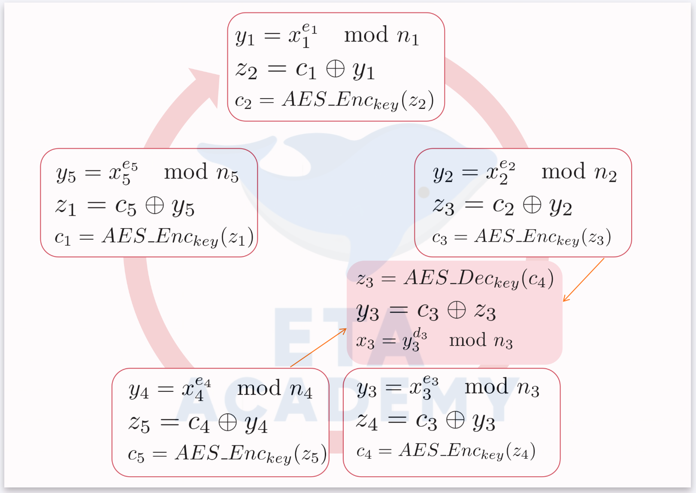

# ETAAcademy-ZKMeme: 28. Ring_Signatures

<table>
  <tr>
    <th>title</th>
    <th>tags</th>
  </tr>
  <tr>
    <td>28. Ring_Signatures</td>
    <td>
      <table>
        <tr>
          <th>zk-meme</th>
          <th>basic</th>
          <th>quick_read</th>
          <td>Ring_Signatures</td>
        </tr>
      </table>
    </td>
  </tr>
</table>

[Github](https://github.com/ETAAcademy)｜[Twitter](https://twitter.com/ETAAcademy)｜[ETA-ZK-Meme](https://github.com/ETAAcademy/ETAAcademy-ZK-Meme)

Authors: [Evta](https://twitter.com/pwhattie), looking forward to your joining

## Demystifying Ring Signatures: Signing Anonymously in a Group

Imagine a group of activists wanting to anonymously leak sensitive information. Regular digital signatures wouldn't work - they reveal the signer's identity. This is where ring signatures come in, allowing any member of a group to anonymously sign a message. Here's a breakdown of the three main types:

### 1. RSA-based Ring Signatures:

RSA is a widely-used cryptographic algorithm for encryption and digital signatures. Encryption uses a public key (pk) to encrypt, while signing uses a private key (sk) to sign, with verification done using the public key.

In RSA-based ring signatures, a group of users collaborates to create a signature, with one real user and others acting as decoys, typically involving 10 users with 1 being the real signer, and the probability of identity leakage is 1/10. Each user has their public and private keys, denoted as $(e_i, n_i)$. The signature involves multiple forward and reverse RSA and AES calculations to create a ring of plausible signers. The final signature is verified by recalculating commitments and challenges.

 

- Assuming 5 users with their own public and private keys $(e_i, n_i)$, the signature involves 4 forward and 1 reverse RSA and AES computation.
- With random numbers $c_4$ and $x_4$, RSA encryption is performed using user 4's public key $(e_4, n_4)$, followed by XOR operation and AES encryption.
- The process involves forward calculation of $c_1, c_2, c_3, c_4'$ and reverse calculation of $x_3 = y_3^{d_3} \mod n_3$, resulting in the ring signature $σ = \{(e_1, n_1), (e_2, n_2), (e_3, n_3), (e_4, n_4), (e_5, n_5), c_1, x_1, x_2, x_3, x_4, x_5\}$.
- Verification entails computing $c_2, c_3, c_4, c_5, c_1'$ using forward RSA and AES calculations and then verifying $c_1 = c_1'$.

### 2. Discrete Logarithm-based Ring Signatures:

In this type of ring signature, a system generator and public parameters are used to create commitments and challenges. Provers select random numbers and compute commitments and challenges based on discrete logarithms. The verifier validates the commitments and challenges to ensure the integrity of the signature. The difference between modes lies in how commitments and challenges are exchanged between the prover and verifier.

In the context of ring signatures, the generator of group $< g_i >$ is denoted as $g_i$, with its order being a prime number $q_i$. Assuming five users, where the third user is the real signer, each with private key $x_i$ and public key $y_i = g_i^{x_i} \mod p_i$, and a set $L = \{y_i, p_i, q_i, g_i\}$. There are n + 1 hash functions: $H:\{0, 1\}^* -> \{0, 1\}^l$ and $H_i:\{0, 1\}^* -> Z_{q_i}$.

- The process involves selecting a random number $s_1 ∈ Z_{q_1}$, computing Pedersen commitment $a_1 = g_1^{c_1}y_1^{s_1}$, and challenge $c_2 = H_2(L,m, a_1)$.
- Subsequently, calculate $a_2, a_3, a_4, a_5, c_3, c_4, c_5, c_1$, where a random number $a$ ∈ $Z_{q_3}$ is chosen, and calculate commitments using the Sigma protocol **$a_3 = g_3^{a}$**.
- Then, compute challenge $c_4 = H_4(L, m, a_3)$.
- For the response, steps 1, 2, 4, and 5 entail Pedersen opening commitments $c_1, s_1, s_2, s_4, s_5$, while step 3 involves the response in the Sigma protocol **$s_3 = a - x_3c_3$**.
- Finally, obtain the ring signature $(c_1, s_1, s_2, s_3, s_4, s_5)$.

Verification entails recalculating Pedersen commitment $a_1 = g_1^{s_1}y_1^{c_1}$ based on the ring signature, computing challenge $c_2 = H_2(L, m, a_1)$, and sequentially calculating $a_2, a_3, a_4, a_5, c_3, c_4, c_5, c_1'$, where the Sigma commitment $a_3 = g_3^{s_3}y_3^{c_3}=g_3^{a-x_3c_3}y_3^{c_3}=g_3^a$ and challenge $c_4 = H_4(L, m, a_3)$ are computed.

- Verify $c_1 == c_1'$.

### 3. Monero Ring Signatures:

It is evident that all five users possess their private keys, enabling them to perform reverse calculations (RSA ring signatures) or Sigma detections at critical steps. Therefore, both ring signatures can be forged. The solution is to add a unique identifier, allowing only a certain user to generate a ring signature, making it a linkable ring signature.

- Utilizes elliptic curve cryptography for efficient calculations.
- Employs Pedersen commitments and Sigma protocols for anonymity and verification.
- Offers strong anonymity while ensuring the message originated from someone in the group.

In an elliptic curve group denoted as G, with a generator G and order n, the abscissa and ordinate of the elliptic curve point belong to the value space $F_q$, where the base domain is $F_q$. Two hash functions are used: $H_s:\{0, 1\}^*-> F_q$ and $H_p: G -> G$.

For key generation, a private key $x$ is chosen from the range [1, n-1], and the public key is computed as P = x·G. The key image is calculated as $I = x · H_p(P)$.

- Similarly, among five users, the third user is the genuine signer.
- Random numbers $q_1$ and $w_1$ are chosen, and two Pedersen commitments are computed as $L_1 = q_1G + w_1P_1$ and $R_1= q_1H_p(P_1) + w_1I$.
- Subsequently, $L_1, L_2, L_3, L_4, L_5$ are calculated sequentially, where a random number $q_3$ is chosen, and two commitments in the Sigma protocol are computed as $L_3 = q_3G$ and $R_3 = q_3H_p(P_3)$.
- Then, the challenge $c = H_s(m, L_1,...,L_5, R_1,...,R_5)$ is computed, and the response is calculated. Steps 4, 5, 1, and 2 involve Pedersen opening commitments $w_4, q_4, w_5, q_5, w_1, q_1, w_2, q_2$, while step 3 in the Sigma protocol entails the response $w_3' = c-(w_1 + w_2 + w_4 + w_5)$ and $q_3' = q_3 - w_3' · x$.
- The ring signature is represented as $σ = \{I, w_1, w_2, w_3', w_4, w_5, q_1, q_2, q_3', q_4, q_5\}$.

For verification, Pedersen commitments $L_1, L_2, L_4, L_5$ are recalculated based on the ring signature, and commitments in the Sigma protocol are computed as $L_3' = q_3'G + w_3'P_3$ and $R_3' = q_3'H_p(P_3)+w_3'I$.

- Verification ensures $w_1 + w_2 + w_3' + w_4 + w_5 == H_s(m, L_1,...,L_5, R_1,...,R_5)$.

**Key Takeaway:**

Ring signatures provide anonymity for digital signatures, fostering privacy in whistleblowing, secure communication, and privacy-focused cryptocurrencies like Monero.
