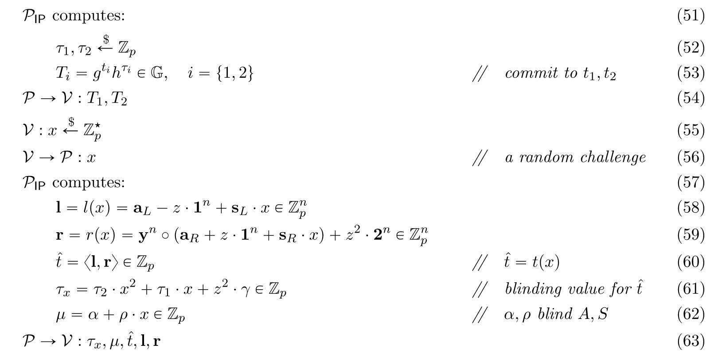
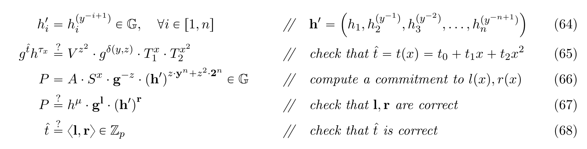

# ETAAcademy-ZKMeme: 36. BulletProof & Diffie-Hellman

<table>
  <tr>
    <th>title</th>
    <th>tags</th>
  </tr>
  <tr>
    <td>36. BulletProof & Diffie-Hellman</td>
    <td>
      <table>
        <tr>
          <th>zk-meme</th>
          <th>basic</th>
          <th>quick_read</th>
          <td>BulletProof_Diffie-Hellman</td>
        </tr>
      </table>
    </td>
  </tr>
</table>

[Github](https://github.com/ETAAcademy)｜[Twitter](https://twitter.com/ETAAcademy)｜[ETA-ZK-Meme](https://github.com/ETAAcademy/ETAAcademy-ZK-Meme)

Authors: [Eta](https://twitter.com/pwhattie), looking forward to your joining

Confidential Transactions (CTs) leverage zero-knowledge proofs (ZKP) to ensure transaction privacy. CTs typically provide two key privacy features: anonymity and confidentiality. Anonymity hides the identities of the sender and receiver in transactions, while confidentiality hides the transaction amounts. Existing ZKP-based CT solutions either require a trusted setup, like zk-SNARKs, or are computationally intensive, like zk-STARKs. Bulletproofs, however, offer an efficient solution for proving that a committed value lies within a specified range without the need for a trusted setup, based on the discrete logarithm (DLOG) assumption.

### Principle:

This approach utilizes Pedersen commitments and their vector commitment variants. The operations of the range proof can be equated through several transformation steps, where the initial equation is intuitive but hard to prove, and the final one is abstract but easier to prove. For example, the prover must needs to show knowledge of a secret value $\nu$ and a random value $\gamma$ that satisfies a Pedersen commitment and falls within a given range:

(1) $V = g^{\nu}h^{\gamma},$

(2) $\nu \in [0, 2^n - 1]$

The amount vector $\vec{\alpha_L} = (\alpha_1,...,\alpha_n) \in \{0,1\}^n$ represents $\nu$ in binary form, fulfilling the inner product of $\langle \vec{\alpha_L}, 2^n \rangle = \nu$.

The prover calculates a vector commitment $A = h^{\alpha}\vec g^{\vec{\alpha_L}}\vec h^{\vec{\alpha_R}} \in G$, and transforms the operation (2) into (3) for the binary constraints of $\vec{\alpha_L}$, $\vec{\alpha_R}$. By choosing a random value $y \in \mathbb{Z_p}$, (3) can be expressed as an inner product (4). Introducing another random value $z \in \mathbb{Z_p}$, the equations combine into a single inner product (5). Applying the Hadamard product to the inner product (6), where $\delta(y, z) = (z - z^2) \langle \vec{1}^n, \vec{y}^n \rangle - z^3 \langle \vec{1}^n, \vec{2}^n \rangle \in \mathbb{Z_p}$, the prover only needs to send two vectors from equation (6) to the verifier for validation using the commitment V:

(3) $\langle \vec{\alpha_L}, \vec 2^n \rangle = \nu, \vec \alpha_L \circ \vec \alpha_R = \vec 0^n, \vec \alpha_R = \vec \alpha_L - \vec 1^n$

(4) $\langle \vec{\alpha_L}, \vec 2^n \rangle = \nu, \langle \vec \alpha_L, \vec \alpha_R \circ \vec y^n \rangle= 0, \langle \vec \alpha_L - \vec 1^n - \vec \alpha_R, \vec y^n \rangle$

(5) $z^2 \langle \vec{\alpha_L}, \vec 2^n \rangle + z \langle \vec \alpha_L - \vec 1^n - \vec \alpha_R, \vec y^n \rangle + \langle \vec \alpha_L, \vec \alpha_R \circ \vec y^n \rangle= z^2 \cdot \nu$

(6) $\langle \vec{\alpha_L}-z\cdot \vec 1^n, \vec y^n \circ(\vec a_R + z \cdot \vec 1^n) + z^2 \vec 2^n \rangle = z^2 \cdot \nu + \delta(y, z)$

To prevent leakage of $\vec{\alpha_L}$ information, two random vectors $\vec{s_L}$ and $\vec{s_R}$ are introduced. The amount vectors $\vec{\alpha_L}$, $\vec{\alpha_R}$ and the random vectors $\vec{s_L}$, $\vec{s_R}$ construct polynomials, leading to the final equation (7): 

$l(X) = (\vec \alpha_L - z \cdot \vec 1^n) + \vec s_L \cdot X$

$r(X) = \vec y^n \circ (\vec \alpha_R + z \cdot \vec 1^n + \vec s_R \cdot X) + z^2\vec 2^n$

$t(X) = \langle l(X), r(X) \rangle = t_0 + t_1X + t_2X^2$

(1) $V = g^{\nu}h^{\gamma}$

(7) $t_0= z^2 \cdot \nu + \delta(y,z)$

### Proof and Verification:

The prover commits two polynomial coefficients $(t_1, t_2)$, sends these two commitments $(T_1, T_2)$, calculates a challenge x (a random point) and sends five responses $\tau_x, \mu, \hat{t}, \vec{l}, \vec{r}$.

The verifier checks the inner product $\langle l, r \rangle$ to verify $t(x)$. The commitment A is a vector commitment to $(\alpha_L, \alpha_R \circ y^n)$ with generators $(g, h', h)$, where $h' = h^{(y^{-n})}$. Similarly, S is a commitment to $(s_L, s_R \circ y^n)$.

### Optimization:

Using vector inner product commitments and halving responses to send $(L_1, R_1), \ldots, (L_k, R_k), (a, b)$, with a total length of $(2k + 2)$, where $k = \log_2 n$.

$\mathbf{a}[:k]=(a*1, \ldots, a_k) \in \mathbb{F}^k, \quad \mathbf{a}[k:] = (a*{k+1}, \ldots, a_n) \in \mathbb{F}^{n-k}$

$\begin{equation*} \mathbf{a}{[:k]}=(a{1}, \ldots,a*{k})\in \mathbb{F}^{k},\quad \mathbf{a}{[k:]}=(a{k+1},\ldots, \alpha*{n})\in \mathbb{F}^{n-k}. \end{equation*}$

### Verification for Multiple Amounts:

The previously described method verifies a single value. To handle verification for multiple amounts, the verification process is extended to operate on aggregates. For example, the inner product and commitment scheme are applied for m different values simultaneously.

$\vec{\alpha_L} = \{0,1\}^{n \cdot m}$

$\vec{\alpha*R} = \vec a_L - 1 \in \mathbb{Z}*{p}^{n \cdot m}$

$l(x)=\mathbf{a}_{L}-z\cdot 1^{n \cdot m}+\mathbf{\vec s}_{L}\cdot X\quad \in \mathbb{Z}\_{p}^{n \cdot m}[X]$

$\begin{align*} & r(X)=\mathbf{y}^{n\cdot m}\circ(\mathbf{a}*{R}+z\cdot 1^{n\cdot m}+\mathbf{s}_{R}\cdot X)\\ & +\sum\nolimits\_{j=1}^{m}z^{1+j}\cdot 0(j-1)n\Vert 2^{n}\Vert 0(m-j)n \tag{65} \end{align_}$

$\begin{equation*} \delta (y, z)=-z^{2}\cdot\langle 1^{n\cdot m}, \mathbf{y}^{n\cdot m}\rangle-\sum\_{j=1}^{m}z^{j+2}\cdot\langle 1^{n}, 2^{n}\rangle \end{equation*}$

$\begin{equation*} g^{t}h^{\tau*{x}}\mathop{=}^{?}g^{\delta (y,z)+z\langle 1^{n\cdot m},\mathbf{y}^{n\cdot m}\rangle}\cdot \mathbf{V}^{z^{3}\mathbf{z}^{m}}\cdot T*{1}^{x}\cdot T\_{2}^{x^{2}} \end{equation*}$

$\begin{equation*} P=AS^{x}\cdot \mathbf{g}^{-z}\cdot \mathbf{h}^{\prime^{z\cdot \mathbf{y}^{n\cdot m}}}\prod*{j=1}^{m}\mathbf{h}_{[(j-1)\cdot m:j\cdot m]}^{\prime^{z^{j+1}}\cdot 2^{n}} \end{equation_}$

### Bonus: Diffie-Hellman Key Exchange

The Diffie-Hellman key exchange allows two parties, Alice and Bob, to establish a shared secret key for secure communication even if they are communicating over an insecure public channel, $key = g^{\alpha \beta}$ or $key = Hash (g^{\alpha \beta})$. The basic Diffie-Hellman key exchange can lead to a constant shared key if the same randomness is used in multiple key generations. To address this, a random number $r$ can be included in the final shared key derivation. This is often done by hashing the product $g^(αβ)$ along with random values $r_1$ (chosen by Alice) and $r_2$ (chosen by Bob). The final key becomes $Hash(g^(αβ), r_1, r_2)$.

- Alice's private key: $SK_1 = \alpha$
- Alice's public key: $PK_1 = g^\alpha$
- Bob's private key: $SK_2 = \beta$
- Bob's public key: $PK_2 = g^\beta$

$(PK_2)^{SK_1} = (g^{\beta})^{\alpha} = g^{\alpha \beta} = (g^{\alpha})^{\beta} = (PK_1)^{SK_2}$
