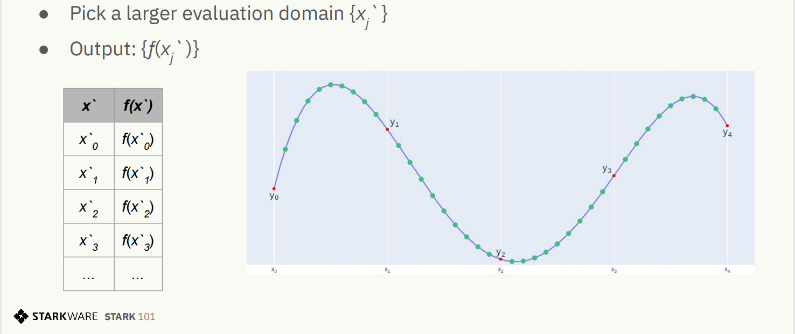

# ETAAcademy-ZKMeme: 41. Low Degree Extension & Polynomial Constraints

<table>
  <tr>
    <th>title</th>
    <th>tags</th>
  </tr>
  <tr>
    <td>41. LDE & Constraints</td>
    <td>
      <table>
        <tr>
          <th>zk-meme</th>
          <th>basic</th>
          <th>quick_read</th>
          <td>LDE_Constraints</td>
        </tr>
      </table>
    </td>
  </tr>
</table>

[Github](https://github.com/ETAAcademy)｜[Twitter](https://twitter.com/ETAAcademy)｜[ETA-ZK-Meme](https://github.com/ETAAcademy/ETAAcademy-ZK-Meme)

Authors: [Eta](https://twitter.com/pwhattie), looking forward to your joining

### Low Degree Extension (LDE)

Low Degree Extension (LDE) is a technique used in cryptographic protocols to efficiently represent and manipulate data. It involves transforming a sequence of data points into a polynomial and then evaluating this polynomial over a larger domain. This process is akin to fitting a curve to a set of points and then extending that curve beyond the original data points.

**Key steps involved in LDE:**

1. **Generate Inputs**: Start with a sequence of inputs $y_0, y_1, y_2, ...$ (e.g., a Fibonacci sequence $a_0, a_1, a_2, ..., a_{1022}$). To make calculations easier, choose another sequence $x_0, x_1, x_2, ...$ (e.g., $g^0, g^1, g^2 ..., g^{1022}$), and pair $x$ and $y$ accordingly (like pairing $a$ with $g$).

2. **Interpolation**: Interpolate these values into a polynomial $f(x_i) = y_i$ (e.g., $f(g^i) = a_i$).

3. **Extension**: LDE expands the domain of a vector by interpolating its values into a polynomial, similar to creating a Reed-Solomon error correction code by extending polynomial evaluations over a larger field. Starting with a set of data points (red dots), a polynomial is fitted to pass through them. Extending this polynomial to a larger domain (e.g., from K to 8K) generates new data points (green dots), representing the extended vector. Interpolation is key in LDE, enabling the transition from a smaller to a larger domain, allowing for vector evaluation over a much-expanded space.

<div  align="center"> 

</div>

**Reed-Solomon Code**

**Reed-Solomon codes** are a cornerstone of coding theory, a field focused on efficiently encoding information. The encoding process maps a message of length $k$ to a codeword of length $n$ over a specific alphabet. Mathematically, this is represented as a function $\text{enc}:\Sigma^k \rightarrow \Sigma^n$. A code can be viewed as a subspace within an _n_-dimensional vector space, where codewords are vectors and code symbols are elements of these vectors.

The **code rate** $\rho = k/n$ measures the efficiency of a code, representing the ratio of original data to encoded data. The **minimum Hamming distance** $d = \min\_{u,v \in C, u \ne v} \Delta(u,v)$ is a crucial parameter that determines a code's error-correcting capability. It's defined as the smallest number of differing symbols between any two distinct codewords. The **minimum Hamming weight** $w$ is the minimum number of non-zero symbols in a codeword $v \in C$.

A larger Hamming distance enables more efficient error detection and correction for Reed-Solomon codes, reducing the number of checks required to verify an execution trace. However, excessively increasing the distance can negatively impact proof efficiency and security by imposing a heavier computational burden on the prover.

**Concet: Expanding the Domain and Preventing Collisions**

When transitioning from a smaller to a larger domain (often referred to as "blowup"), it's crucial to avoid simple expansion. Instead, a specific subset or coset within the larger domain is chosen to mitigate the risk of collisions and redundant data. This is essential for maintaining security and efficiency.

For instance, in the PLONK protocol, carefully selected vectors are used to optimize the placement of data points. To construct a specific domain, two elements, $w$ and $h$, are chosen from the underlying field $F$. This pair defines a sequence of points: $\{x_i'\} = w, w \cdot h, w \cdot h^2, \dots, w \cdot h^{8191}$, where $w$ and $h$ are elements from $F$. A polynomial is then evaluated at each of these points, resulting in a set of values: $\{f(x_i')\} = f(w), f(w \cdot h), f(w \cdot h^2)$, which constitutes a Reed-Solomon codeword. Finally, each point $w \cdot h$ is paired with its corresponding polynomial value $f(w \cdot h)$, and these pairs are used to interpolate a new polynomial $f(w \cdot h^i)$.

**Commit on LDE**

In the second step, commitment is made where the leaves of the Merkle tree are the results of the computation on the larger domain $8K$, represented as $\{f(x_i')\}$. The values are hashed pairwise to build up the tree layer by layer, with the root hash being sent to the verifier. To submit data, one can either send all 8K elements or use a Merkle tree and send just the root hash.

<details><summary><b>🌰 Example & Code</b></summary>

**Fibonacci Sequence**

Consider the **FibonacciSq (Fibonacci Square)** sequence, where each element is the sum of the squares of the two preceding elements, $a_{n+2} = a_{n+2}^2 + a_n^2$. Since the elements grow rapidly, they are taken modulo a prime number, $3 \cdot 2^{30} + 1$, which produces a finite field $\mathbb{F}\_{3221225473}$. The Fibonacci sequence can be infinite, but in this example, it is computed up to the 1023rd element, starting with $a_0 = 1$, $a_1 = X$, with **$X = 3141592$** and $a_{1022} = 2338775057$. The sequence $a$ is called the trace of FibonacciSq or simply the trace when the context is clear.

```python
from field import FieldElement
a = [FieldElement(1), FieldElement(3141592)]
while len(a) < 1023:
    a.append(a[-2] * a[-2] + a[-1] * a[-1])

```

Recall that $\mathbb{F}^\times$ denotes the multiplicative group of $\mathbb{F}$, which we get from $\mathbb{F}$ by omitting the zero element with the induced multiplication from the field. A subgroup of size 1024 exists because $\mathbb{F}^\times$ is a cyclic group of size $3\cdot 2^{30}$, so it contains a subgroup of size $2^i$ for any $0 \leq i \leq 30$. When $k$ divides $|\mathbb{F}^\times|$, $g^k$ generates a group of size $\frac {|\mathbb{F}^\times|}{k}$. If we find an element $g \in \mathbb{F}$ whose (multiplicative) order is 1024, then $g$ will generate such a group.

```python
g = FieldElement.generator() ** (3 * 2 ** 20)
G = [g ** i for i in range(1024)]
```

polynomial  module provides a Lagrange interpolation function by interpolate_poly(x_values, y_values) function, who returns the unique  Polynomial  of degree <  len(x_values)  instance that evaluates to  y_values[i]  on x_values[i]  for all i.

```python
from polynomial import interpolate_poly
f = interpolate_poly(G[:-1], a)

```

**Evaluating on a Larger Domain**

To extend the evaluation of the polynomial f from its trace on the domain G to a larger domain and thereby create a Reed-Solomon error correction code, we choose a new domain that is 8 times larger than G. This larger domain is constructed by selecting a group H of size 8192 (which is possible because 8192 divides the order of the multiplicative group $|\mathbb{F}^\times|$. The elements of this group H are then multiplied by the generator w of $\mathbb{F}^\times$to form a coset, resulting in a new evaluation domain `eval_domain`, represented as $\{w \cdot h^i \mid 0 \leq i < 8192\}$, where h is the generator of H.
The trace, viewed as evaluations of a polynomial $f$ on $G$, can now be extended by evaluating $f$ over a larger domain, thereby creating a Reed-Solomon error correction code.

```python
w = FieldElement.generator()
h = w ** ((2 ** 30 * 3) // 8192)
H = [h ** i for i in range(8192)]
eval_domain = [w * x for x in H]

```

Time to use interpolate_poly and Polynomial.poly to evaluate over the coset - similarly to the way we did a few minutes ago.

```python
f = interpolate_poly(G[:-1], a)
f_eval = [f(d) for d in eval_domain]
```

**Comments**

We will use [Sha256](https://en.wikipedia.org/wiki/SHA-2)-based [Merkle Trees](https://en.wikipedia.org/wiki/Merkle_tree) as our commitment scheme.

```python
from merkle import MerkleTree
f_merkle = MerkleTree(f_eval)

```

**Channel**
The Channel class in a STARK proof system replaces the verifier by transforming the interactive protocol into a non-interactive one using the Fiat-Shamir Heuristic. You'll use the Channel to send data, like the root of your Merkle Tree, and receive random numbers or FieldElement instances as if interacting with a verifier. Additionally, you can access the accumulated proof-so-far by printing the Channel.proof, which contains all the data passed through the channel up to that point.

```python
from channel import Channel
channel = Channel()
channel.send(f_merkle.root)
print(channel.proof)
```

</details>

### Polynomial Constraints

In a zero-knowledge proof, the prover aims to convince the verifier of their knowledge of a secret value $x$ without revealing any information about $x$. This is achieved by constructing a set of constraints that the computation trace $a$ must adhere to. These constraints are formulated as rational functions—essentially, divisions of polynomials. Similar to how integer division produces whole numbers only under specific conditions (e.g., 4 divided by 2), polynomial division might or might not result in a polynomial. 


1. **Polynomial Representation of Constraints:** The initial step involves transforming constraints defined over the Fibonacci sequence into polynomial equations. This means expressing the sequence’s properties in terms of polynomial relationships.

2. **Roots as Proof Verifiers:** A polynomial’s roots are values that produce zero when substituted into the polynomial. If a specific set of values (e.g., $g^0, g^1, g^2, ..., g^{1022}$) are roots of a constructed polynomial, it validates the original constraints.

3. **Interpolation and Rational Functions:** To demonstrate that a value (g) is a root of a polynomial $f(x)$, it's necessary to prove that dividing $f(x)$ by $(x-g)$ yields another polynomial $\frac{f(x)}{x - g}$. In essence, if g is a root of the dividend polynomial and $x-g$ is a divisor, then $g$ must also be a root of the quotient polynomial. This process involves converting the identified roots into rational functions that represent polynomials if and only if the initial constraints are satisfied.

To simplify our proof, we combine the three polynomials $p_0(x)$, $p_1(x)$, and $p_2(x)$ into a single composition polynomial $CP(x) = \alpha_0 \cdot p_0(x) + \alpha_1 \cdot p_1(x) + \alpha_2 \cdot p_2(x)$, using random field elements $\alpha_0$, $\alpha_1$, and $\alpha_2$ from the verifier or channel. Proving that $CP$ is a polynomial ensures that $p_0$, $p_1$, and $p_2$ are also polynomials.

<details><summary><b>🌰 Example & Code</b></summary>


The first constraint involves ensuring that f(x) - 1 is divisible by (x - 1) to construct the polynomial  $p_0(x) = \frac{f(x) - 1}{x - 1}$, given that f(x) - 1 has a root at x = 1.

```python
numer0 = f - 1
denom0 = X - 1
p0 = numer0 / denom0
```

Construct the polynomial `p1` representing the second constraint, $p_1(x)= \frac{f(x) - 2338775057}{x - g^{1022}}$, similarly:

```python
numer1 = f - 2338775057
denom1 = X - g**1022
p1 = numer1 / denom1
```

Construct the third constraint `p2` in a similar manner to the construction of `p0` and `p1`, using polynomial composition. Along the way, verify that $g^{1020}$ is a root of the **numerator** while $g^{1021}$ is not.

```python
numer2 = f(g**2 * X) - f(g * X)**2 - f**2
print("Numerator at g^1020 is", numer2(g**1020))
print("Numerator at g^1021 is", numer2(g**1021))
denom2 = (X**1024 - 1) / ((X - g**1021) * (X - g**1022) * (X - g**1023))

p2 = numer2 / denom2
```

To simplify the proof, we create a composition polynomial $CP(x) = \alpha_0 \cdot p_0(x) + \alpha_1 \cdot p_1(x) + \alpha_2 \cdot p_2(x)$ using random field elements. Next, we generate this proof by constructing CP.

```python
def get_CP(channel):
    alpha0 = channel.receive_random_field_element()
    alpha1 = channel.receive_random_field_element()
    alpha2 = channel.receive_random_field_element()
    return alpha0*p0 + alpha1*p1 + alpha2*p2
```

Commit on the Composition Polynomial
Finally, evaluate the composition polynomial over the `eval_domain`, build a Merkle tree from the results, and send the root over the channel, just like the LDE trace commitment in part 1.

</details>

<details><summary><b>Source</b></summary>

[Source](https://github.com/ETAAcademy/ETAAcademy-ZK-Meme/tree/main/Appendix/stark101)

```python
from channel import Channel
from field import FieldElement
from merkle import MerkleTree
from polynomial import interpolate_poly, Polynomial

def part1():
t = [FieldElement(1), FieldElement(3141592)]
while len(t) < 1023:
t.append(t[-2] _ t[-2] + t[-1] _ t[-1])
g = FieldElement.generator() ** (3 \* 2 ** 20)
points = [g ** i for i in range(1024)]
h*gen = FieldElement.generator() ** ((2 ** 30 * 3) // 8192)
h = [h_gen ** i for i in range(8192)]
domain = [FieldElement.generator() _ x for x in h]
p = interpolate_poly(points[:-1], t)
ev = [p.eval(d) for d in domain]
mt = MerkleTree(ev)
ch = Channel()
ch.send(mt.root)
return t, g, points, h_gen, h, domain, p, ev, mt, ch

def part2():
t, g, points, h*gen, h, domain, p, ev, mt, ch = part1()
numer0 = p - Polynomial([FieldElement(1)])
denom0 = Polynomial.gen_linear_term(FieldElement(1))
q0, r0 = numer0.qdiv(denom0)
numer1 = p - Polynomial([FieldElement(2338775057)])
denom1 = Polynomial.gen_linear_term(points[1022])
q1, r1 = numer1.qdiv(denom1)
inner_poly0 = Polynomial([FieldElement(0), points[2]])
final0 = p.compose(inner_poly0)
inner_poly1 = Polynomial([FieldElement(0), points[1]])
composition = p.compose(inner_poly1)
final1 = composition * composition
final2 = p _ p
numer2 = final0 - final1 - final2
coef = [FieldElement(1)] + [FieldElement(0)] _ 1023 + [FieldElement(-1)]
numerator*of_denom2 = Polynomial(coef)
factor0 = Polynomial.gen_linear_term(points[1021])
factor1 = Polynomial.gen_linear_term(points[1022])
factor2 = Polynomial.gen_linear_term(points[1023])
denom_of_denom2 = factor0 * factor1 \* factor2
denom2, r_denom2 = numerator_of_denom2.qdiv(denom_of_denom2)
q2, r2 = numer2.qdiv(denom2)
cp0 = q0.scalar_mul(ch.receive_random_field_element())
cp1 = q1.scalar_mul(ch.receive_random_field_element())
cp2 = q2.scalar_mul(ch.receive_random_field_element())
cp = cp0 + cp1 + cp2
cp_ev = [cp.eval(d) for d in domain]
cp_mt = MerkleTree(cp_ev)
ch.send(cp_mt.root)
return cp, cp_ev, cp_mt, ch, domain

```

</details>
