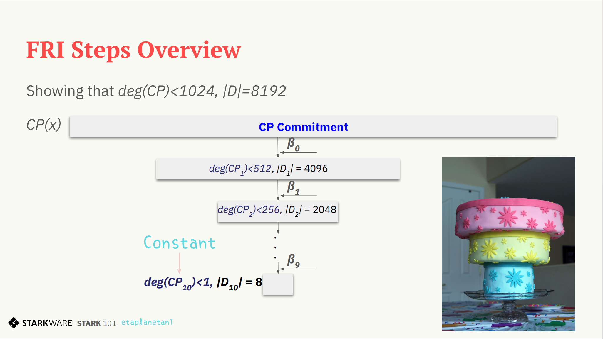
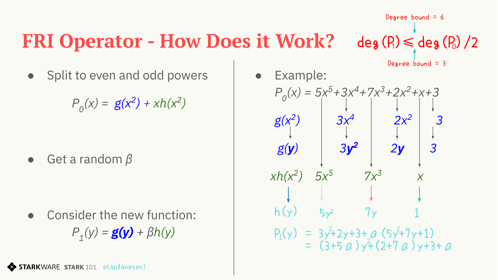
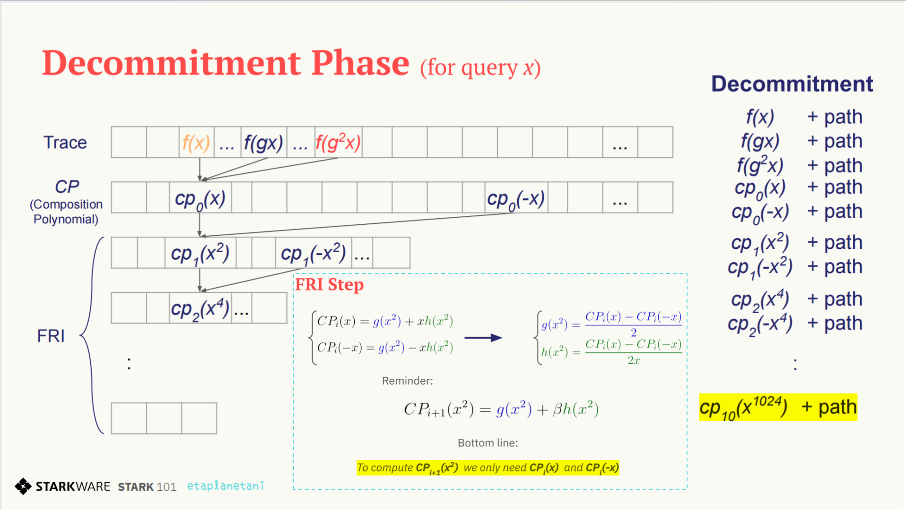
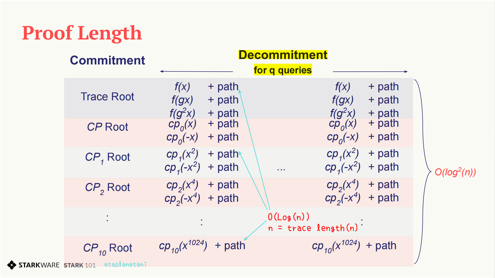

# ETAAcademy-ZKMeme: 42. FRI Folding & Decommitment

<table>
  <tr>
    <th>title</th>
    <th>tags</th>
  </tr>
  <tr>
    <td>42. FRI Folding & Decommitment</td>
    <td>
      <table>
        <tr>
          <th>zk-meme</th>
          <th>basic</th>
          <th>quick_read</th>
          <td>FRI_Fold_Decommit</td>
        </tr>
      </table>
    </td>
  </tr>
</table>

[Github](https://github.com/ETAAcademy)｜[Twitter](https://twitter.com/ETAAcademy)｜[ETA-ZK-Meme](https://github.com/ETAAcademy/ETAAcademy-ZK-Meme)

Authors: [Evta](https://twitter.com/pwhattie), looking forward to your joining

# FRI Folding & Decommitment

Using the FRI protocol, the prover can demonstrate that the compositional polynomial (CP) is close to a low-degree polynomial. The FRI operator reduces the polynomial's degree and domain size through recursive folding, and the decommitment process ensures that the prover's computations are correct, convincing the verifier of the statement's validity.

## FRI Commitment and Protocol: Composed Polynomial CP is a Polynomial

Instead of proving that CP is a Polynomial, the goal is to show that **the composed polynomial (CP) is close to a low-degree polynomial**, meaning a polynomial with a degree less than some agreed-upon bound, $D$. In the context of STARKs, "low degree" is defined relative to the size of the "small domain."

The concept of "closeness" is understood in terms of "distance," where the distance between a function $f$ and a polynomial $p$ is the number of points where they differ. Proving that this distance is below a certain threshold can demonstrate the truth of a statement with a unique solution, without requiring it to be extremely small.

The FRI commitment and protocol are used to prove that statement. From the prover's viewpoint, there is only one polynomial with no approximation. However, this approximation is viewed from the verifier's perspective, as the prover does not reveal the entire polynomial or its values.

**FRI and the FRI Protocol: Proof Method and Operational Steps**

FRI stands for Fast Reed-Solomon Interactive Oracle Proofs of Proximity, including **Random beta -> Apply the FRI operator -> Commit on it:**

First, a random value $\beta$ is received from the verifier. Then, the FRI operator is applied to the polynomial, which halves both the domain size and the degree bound with each application. For example, a polynomial $CP_0$ with a degree less than 1024 and a domain size of 8192 is reduced to a polynomial $CP_1$ with a degree less than 512 and a domain size of 4096. This process of receiving $\beta$, applying the FRI operator, and committing to the result is repeated until the polynomial is reduced to a point where its degree is bounded by 1, or it becomes a constant, which can then be provided to the verifier.

<div style="text-align: center;">
    
    
</div>

**FRI Folding**

1. **Polynomial Splitting:** Start with the function $CP_0(x)$ or $P_0(x)$ and decompose it into two parts: even and odd powers. The even terms are represented as $g(x^2)$, and the odd one as $xh(x^2)$. Therefore, the polinomial can be written as $P_0(x) = g(x^2) + xh(x^2)$.

2. **Random β:** A random β is introduced to prevent the prover from cheating and to allow the verifier to be confident in the proof. The odd are factored out with $x$, and the polynomial is transformed into a new one $P_1(y) = g(y) + βh(y)$, where $y = x^2$. This transformation effectively reduces the degree of the polynomial by half, as well as the size of the domain.

3. **Degree Reduction:** The FRI folding process is repeated until the polynomial is reduced to a constant. After 10 rounds, for example, only 8 elements remain, which are then sent to the verifier. The goal is to reduce the degree of the polynomial until it becomes a constant polynomial, which is then provided to the verifier.

For instance, consider the polynomial $P_0(x) = 5x^5 + 3x^4 + 7x^3 + 2x^2 + x + 3$ can be split into even $g(x^2) = 3x^4 + 2x^2 + 3$ and odd $xh(x^2) = 5x^5 + 7x^3 + x$ parts. After applying the FRI operator, the poly nomial becomes $P_1(y) = (3 + 5\beta)y^2 + (2 + 7\beta)y + 3 + \beta$ by adding a random $\beta$, with the even $g(y) = 3y^2 + 2y + 3$ and the odd $h(y) = 5y^2 + 7y + 1$.

Starting with a polynomial of degree 5, the FRI operator reduces the degree of $P_1$ to at most half of the original polynomial $P_0$’s degree, i.e., $\text{deg}(P_1) \leq \text{deg}(P_0)/2$, which halves the degree bound at each step by repeating the process until it becomes a constant.

<details><summary><b>🌰 Example & Code</b></summary>

**FRI Folding** constructs layers by 1) generating a new domain, 2) creating a polynomial from the previous layer, and 3) evaluating it on the new domain to form the next FRI layer.

**Domain Generation**

The first FRI domain is the `eval_domain`, generated as $w, w\cdot h, w\cdot h^2, ..., w\cdot h^{8191}$ in Part 1. Each subsequent FRI domain is generated by taking the first half of the previous domain and squaring its elements. Note that taking the squares of the second half of each elements in `eval_domain` yields exactly the same result as taking the squares of the first half. For example, the second layer is $w^2, (w\cdot h)^2, (w\cdot h^2)^2, ..., (w\cdot h^{4095})^2$, and the third layer is $w^4, (w\cdot h)^4, (w\cdot h^2)^4, ..., (w\cdot h^{2047})^4$, and so on.

```python
def next_fri_domain(fri_domain):
    return [x ** 2 for x in fri_domain[:len(fri_domain) // 2]]
```

**New Polynomial**

The FRI Folding Operator updates polynomials by:

1. Starting with the composition polynomial `cp` generated in Part 2.
2. Getting a random field element $\beta$ (by calling `Channel.receive_random_field_element()`).
3. Multiplying odd coefficients by $\beta$ and summing consecutive pairs of coefficients(by calling `Polynomial.poly`) to form the next polynomial from a list of coefficients `l` (by calling `Polynomial(l)`).

For a polynomial $p_{k}(x) := \sum_{i=0} ^{m-1} c_i x^i$ of degree < m, the next polynomial $p_{k+1}(x)$ has degree $< \frac{m}{2}$ and is:

$p_{k+1}(x) := \sum_{i=0} ^{  m / 2 - 1 } (c_{2i} + \beta \cdot c_{2i + 1}) x^i$

```python
def next_fri_polynomial(poly,  beta):
    odd_coefficients = poly.poly[1::2]
    even_coefficients = poly.poly[::2]
    odd = beta * Polynomial(odd_coefficients)
    even = Polynomial(even_coefficients)
    return odd + even
```

**Next FRI Layer**

Putting it Together to returns the next polynomial, the next domain, and the evaluation of this next polynomial on this next domain.

```python
def next_fri_layer(poly, domain, beta):
    next_poly = next_fri_polynomial(poly, beta)
    next_domain = next_fri_domain(domain)
    next_layer = [next_poly(x) for x in next_domain]
    return next_poly, next_domain, next_layer
```

**FRI Commitments**

The `FriCommit` method takes five arguments: the composition polynomial `cp`, the initial FRI domain `eval_domain`, its evaluation `cp_eval` or **FRI layer**. the first Merkle tree `cp_merkle`, and a `channel` object to return four lists: FRI polynomials, FRI domains, FRI layers, and FRI Merkle trees (by calling `MerkleTree(next_layer)`).

The method extends FRI lists in a loop using the last elements of each until the last polynomial is a constant, then sends this constant over the channel as a string.

```python
def FriCommit(cp, domain, cp_eval, cp_merkle, channel):
    fri_polys = [cp]
    fri_domains = [domain]
    fri_layers = [cp_eval]
    fri_merkles = [cp_merkle]
    while fri_polys[-1].degree() > 0:
        beta = channel.receive_random_field_element()
        next_poly, next_domain, next_layer = next_fri_layer(fri_polys[-1], fri_domains[-1], beta)
        fri_polys.append(next_poly)
        fri_domains.append(next_domain)
        fri_layers.append(next_layer)
        fri_merkles.append(MerkleTree(next_layer))
        channel.send(fri_merkles[-1].root)
    channel.send(str(fri_polys[-1].poly[0]))
    return fri_polys, fri_domains, fri_layers, fri_merkles
```

</details>

## Decommitment: Prover Convinces the Verifier of the Correctness of the Computation

The proof consists of two main parts: **Commitment** and **Decommitment**.

**[Commitment](https://github.com/ETAAcademy/ETAAcademy-ZK-Meme/blob/main/41_LDE.md)**

The commitment process involves three key steps:

1. **Commit to the Trace on Low Degree Extension (LDE):**

   - The prover computes a trace over an LDE and commits to it by constructing a Merkle tree. The root of this Merkle tree is part of the commitment, and the prover sends only the root of the tree or trace to the verifier (without sending all the leaf nodes).

2. **Commit to the Composition Polynomial (CP) on the LDE:**

   - The prover calculates the composition polynomial (CP), which corresponds to a function $f(x)$ derived from the trace via linear combination. A Merkle tree is constructed for the CP values, and the root of this tree (the CP root) is sent to the verifier.

3. **Perform FRI and Commit:**
   - Using FRI (Fast Reed-Solomon Interactive Oracle Proofs of Proximity), the prover reduces the CP to smaller polynomials. For each reduced polynomial, a Merkle tree is constructed, and the roots of these trees are sent to the verifier. This sequence of roots serves as the complete commitment, demonstrating the correctness of the computation.

<div style="text-align: center;">
    
    
</div>

**Decommitment**

Decommitment is the process by which the prover reveals their commitments to demonstrate to the verifier that the computation was carried out correctly. The procedure is as follows:

1. **Verifier's Random Queries:**

   - The verifier sends $q$ random elements to the prover, who must then provide corresponding validation data for each query.

2. **Correct Trace to CP Transition:**

   - The prover must convince the verifier that the transition from the trace values $f(x), f(gx), f(g^2x)$ to the composition polynomial $CP_0(x)$ was performed correctly.
   - The verifier sends a random value $x$ to the prover. In response, the prover sends back the values $f(x), f(gx), f(g^2x)$ and $CP_0(x)$.
   - Additionally, the prover provides a Merkle proof (authentication path) for these values, showing that they are not fabricated.
   - The verifier can then calculate $CP_0(x)$ from the provided values $f(x), f(gx), f(g^2x)$ and check that it matches the received data $CP_0(x)$, ensuring the trace’s correctness. The Merkle proof confirms that these values are correctly committed.
   - The verifier computes $CP_0(x)$ and checks that it matches $f(x), f(gx), f(g^2x)$, as all trace values are roots of the composition polynomial $CP$. Since a polynomial of degree $d-1$ is uniquely defined by $d$ points, any deviation suggests a fake $CP$. The Merkle tree proof confirms the authenticity of these values and then the process shifts to FRI, which verifies that the degree of $CP$ is low. Instead of altering $CP$, a malicious prover might try to tamper with the trace by giving incorrect $f(x)$ values.

3. **Correct Transition Between FRI Layers:**

   - The prover must show that the transitions between successive FRI layers were done correctly.
   - To validate the transition from $CP_0$ to $CP_1$, for example, the prover sends $CP_0(x)$, $CP_0(-x)$, and the relevant Merkle proof. The verifier can then use these to compute $CP_1(x^2)$ using the equation $CP_1(x^2) = g(x^2) + \beta h(x^2)$ and check that the correctness of the computation.
   - Similarly, for each subsequent layer, the prover sends the corresponding values $CP_i(x)$, $CP_i(-x)$, along with the Merkle proof and the verifier checks the computation. This continues until the verifier computes $CP_{10}(x^{1024})$.
   - FRI needs to transform into a Polynomial Commitment Scheme (PCS) to enable queries at arbitrary random points using the Merkle tree, allowing for the verification of more points.

**Data Transmission by the Prover**

The prover needs to send $O(\log^2(n))$ information to the verifier for a trace length $n = 1023$.

- For each query, the prover must send $O(\log n)$ elements, and for each element, the prover also sends an authentication path of length $O(\log n)$. For $Q$ queries, the prover sends $Q \times O(\log^2(n))$ data.

- The prover sends values $f(x), f(gx), f(g^2x)$ for the first layer and $CP_i(x), CP_i(-x^2)$ along with their authentication paths for each subsequent layer. With all this data, the verifier is convinced that the prover has performed the computation correctly, thus verifying the correctness of the Fibonacci sequence statement. This completes the STARK proof and convinces the verifier.

<details><summary><b>🌰 Example & Code</b></summary>

**Decommit on a Query**

The goal is to verifying commitments by two functions:

1. `decommit_on_fri_layers` - sends over the channel data showing that each FRI layer is consistent with the others, when sampled at a specified index, i.e, $CP_i(x)$ and $CP_i(-x)$.
2. `decommit_on_query` - sends data $f(x), f(gx), f(g^2x)$ required for decommiting on the trace and then calls `decommit_on_fri_layers`.

**Decommit on the FRI Layers**

The `decommit_on_fri_layers` function verifies the consistency of FRI layers by sending data over a channel for each layer at a given index. For each layer, it sends the element at the index, its authentication path, the element's sibling (at the calculated sibling index $(idx + \frac{ k}{2}) \mod {k}$, where $k$ is the length of the relevant FRI layer), and the sibling's authentication path. For example, if the element is $cp_i(x)$, then its sibling is $cp_i(-x)$, where $cp_i$ is the current layer's polynomial, and x is an element from the current layer's domain. In the final FRI layer, only the element is sent since all elements in that layer are identical. All data are converted to strings before being transmitted.

```rust
def decommit_on_fri_layers(idx, channel):
    for layer, merkle in zip(fri_layers[:-1], fri_merkles[:-1]):
        length = len(layer)
        idx = idx % length
        sib_idx = (idx + length // 2) % length
        channel.send(str(layer[idx]))
        channel.send(str(merkle.get_authentication_path(idx)))
        channel.send(str(layer[sib_idx]))
        channel.send(str(merkle.get_authentication_path(sib_idx)))
    channel.send(str(fri_layers[-1][0]))
```

**Decommit on the Trace Polynomial**
The `decommit_on_query` function sends the values $f(x)$, $f(gx)$, and $f(g^2x)$ with their authentication paths, allowing the verifier to check consistency with the first FRI layer. It then calls `decommit_on_fri_layers` to verify the FRI layers, completing the decommitment process.

```rust
def decommit_on_query(idx, channel):
    assert idx + 16 < len(f_eval), f'query index: {idx} is out of range. Length of layer: {len(f_eval)}.'
    channel.send(str(f_eval[idx])) # f(x).
    channel.send(str(f_merkle.get_authentication_path(idx))) # auth path for f(x).
    channel.send(str(f_eval[idx + 8])) # f(gx).
    channel.send(str(f_merkle.get_authentication_path(idx + 8))) # auth path for f(gx).
    channel.send(str(f_eval[idx + 16])) # f(g^2x).
    channel.send(str(f_merkle.get_authentication_path(idx + 16))) # auth path for f(g^2x).
    decommit_on_fri_layers(idx, channel)
```

**Decommit on a Set of Queries**
The `decommit_on_query()` is used to decommit on 3 random indices generated by `Channel.receive_random_int`, finalizing the proof.

```rust
def decommit_fri(channel):
    for query in range(3):
        # Get a random index from the verifier and send the corresponding decommitment.
        decommit_on_query(channel.receive_random_int(0, 8191-16), channel)
```

**Proving Time**

```python
import time
from tutorial_sessions import part1, part3

start = time.time()
start_all = start
print("Generating the trace...")
_, _, _, _, _, _, _, f_eval, f_merkle, _ = part1()
print(f'{time.time() - start}s')
start = time.time()
print("Generating the composition polynomial and the FRI layers...")
fri_polys, fri_domains, fri_layers, fri_merkles, channel = part3()
print(f'{time.time() - start}s')
start = time.time()
print("Generating queries and decommitments...")
decommit_fri(channel)
print(f'{time.time() - start}s')
start = time.time()
print(channel.proof)
print(f'Overall time: {time.time() - start_all}s')
print(f'Uncompressed proof length in characters: {len(str(channel.proof))}')

```

</details>

<details><summary><b>🌲 Source</b></summary>

[Source](https://github.com/ETAAcademy/ETAAcademy-ZK-Meme/tree/main/Appendix/stark101)

```python
from channel import Channel
from field import FieldElement
from merkle import MerkleTree
from polynomial import interpolate_poly, Polynomial


def part1():
    t = [FieldElement(1), FieldElement(3141592)]
    while len(t) < 1023:
        t.append(t[-2] * t[-2] + t[-1] * t[-1])
    g = FieldElement.generator() ** (3 * 2 ** 20)
    points = [g ** i for i in range(1024)]
    h_gen = FieldElement.generator() ** ((2 ** 30 * 3) // 8192)
    h = [h_gen ** i for i in range(8192)]
    domain = [FieldElement.generator() * x for x in h]
    p = interpolate_poly(points[:-1], t)
    ev = [p.eval(d) for d in domain]
    mt = MerkleTree(ev)
    ch = Channel()
    ch.send(mt.root)
    return t, g, points, h_gen, h, domain, p, ev, mt, ch


def part2():
    t, g, points, h_gen, h, domain, p, ev, mt, ch = part1()
    numer0 = p - Polynomial([FieldElement(1)])
    denom0 = Polynomial.gen_linear_term(FieldElement(1))
    q0, r0 = numer0.qdiv(denom0)
    numer1 = p - Polynomial([FieldElement(2338775057)])
    denom1 = Polynomial.gen_linear_term(points[1022])
    q1, r1 = numer1.qdiv(denom1)
    inner_poly0 = Polynomial([FieldElement(0), points[2]])
    final0 = p.compose(inner_poly0)
    inner_poly1 = Polynomial([FieldElement(0), points[1]])
    composition = p.compose(inner_poly1)
    final1 = composition * composition
    final2 = p * p
    numer2 = final0 - final1 - final2
    coef = [FieldElement(1)] + [FieldElement(0)] * 1023 + [FieldElement(-1)]
    numerator_of_denom2 = Polynomial(coef)
    factor0 = Polynomial.gen_linear_term(points[1021])
    factor1 = Polynomial.gen_linear_term(points[1022])
    factor2 = Polynomial.gen_linear_term(points[1023])
    denom_of_denom2 = factor0 * factor1 * factor2
    denom2, r_denom2 = numerator_of_denom2.qdiv(denom_of_denom2)
    q2, r2 = numer2.qdiv(denom2)
    cp0 = q0.scalar_mul(ch.receive_random_field_element())
    cp1 = q1.scalar_mul(ch.receive_random_field_element())
    cp2 = q2.scalar_mul(ch.receive_random_field_element())
    cp = cp0 + cp1 + cp2
    cp_ev = [cp.eval(d) for d in domain]
    cp_mt = MerkleTree(cp_ev)
    ch.send(cp_mt.root)
    return cp, cp_ev, cp_mt, ch, domain

# from part 3


def next_fri_domain(domain):
    return [x ** 2 for x in domain[:len(domain) // 2]]


def next_fri_polynomial(poly, alpha):
    odd_coefficients = poly.poly[1::2]
    even_coefficients = poly.poly[::2]
    odd = Polynomial(odd_coefficients).scalar_mul(alpha)
    even = Polynomial(even_coefficients)
    return odd + even


def next_fri_layer(poly, dom, alpha):
    next_poly = next_fri_polynomial(poly, alpha)
    next_dom = next_fri_domain(dom)
    next_layer = [next_poly.eval(x) for x in next_dom]
    return next_poly, next_dom, next_layer


def part3():
    cp, cp_ev, cp_mt, ch, domain = part2()
    # FriCommit function
    fri_polys = [cp]
    fri_doms = [domain]
    fri_layers = [cp_ev]
    merkles = [cp_mt]
    while fri_polys[-1].degree() > 0:
        alpha = ch.receive_random_field_element()
        next_poly, next_dom, next_layer = next_fri_layer(fri_polys[-1], fri_doms[-1], alpha)
        fri_polys.append(next_poly)
        fri_doms.append(next_dom)
        fri_layers.append(next_layer)
        merkles.append(MerkleTree(next_layer))
        ch.send(merkles[-1].root)
    ch.send(str(fri_polys[-1].poly[0]))
    return fri_polys, fri_doms, fri_layers, merkles, ch

```

</details>
