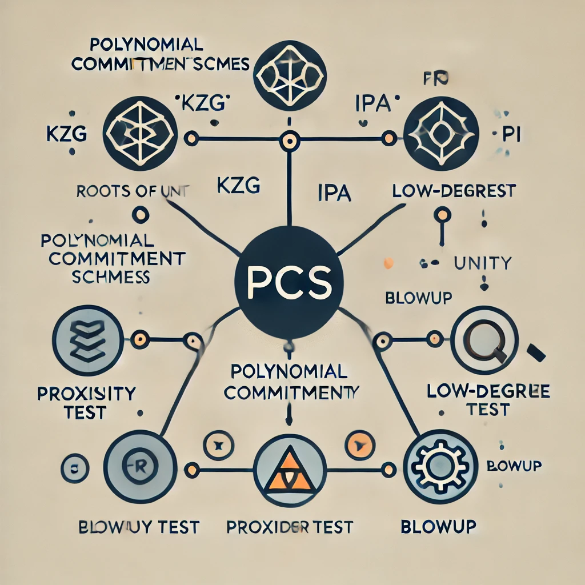

# ETAAcademy-ZKMeme: 43. PCSs & Security

<table>
  <tr>
    <th>title</th>
    <th>tags</th>
  </tr>
  <tr>
    <td>43. PCSs & Security</td>
    <td>
      <table>
        <tr>
          <th>zk-meme</th>
          <th>basic</th>
          <th>quick_read</th>
          <td>PCSs & Security</td>
        </tr>
      </table>
    </td>
  </tr>
</table>

[Github](https://github.com/ETAAcademy)｜[Twitter](https://twitter.com/ETAAcademy)｜[ETA-ZK-Meme](https://github.com/ETAAcademy/ETAAcademy-ZK-Meme)

Authors: [Evta](https://twitter.com/pwhattie), looking forward to your joining

# Polynomial Commitment Schemes (PCS) and Security

**Polynomial Commitment Schemes (PCS)** are cryptographic protocols used to verify the knowledge of a polynomial and its evaluation at a specific point.

A PCS involves two parties: a prover and a verifier. The prover claims to know a polynomial $f(x)$ with a specific degree $d$ and a value $v$ at a point $u$.

The PCS process follows these steps:

1. **Commitment:** The prover sends a commitment to the polynomial $f(x)$ to the verifier. This commitment serves as a cryptographic representation of the polynomial.
2. **Challenge:** The verifier sends a random challenge $u$ to the prover. This challenge represents the point at which the prover must demonstrate knowledge of the polynomial's value.
3. **Response:** The prover responds with the value $v = f(u)$ and a proof that the polynomial $f(x)$ indeed evaluates to $v$ at $u$, and that its degree is less than or equal to $d$, deg(f) ≤ d.
4. **Verification:** The verifier checks the proof to ensure its validity and confirm that the prover knows the polynomial and its evaluation at the specified point.

### Common PCSs and Their Development

**KZG (Kate, Zaverucha, Goldberg)** is a popular polynomial commitment scheme. It's based on pairing and requires a trusted setup, making it less transparent than some other schemes. It's also not quantum-resistant due to its reliance on elliptic curves.

Despite these limitations, KZG offers several advantages:

- **Homomorphic Properties:** These allow for efficient batching and aggregation of proofs.
- **Efficiency:** KZG has efficient verification, though pairing operations can be computationally expensive.
- **Complexity:** KZG proofs are relatively small, $O(1)$, consisting of a single elliptic curve point. The prover’s cost is $O(n \log n)$, mainly due to FFT (Fast Fourier Transform) operations. The verifier’s cost is $O(1)$, but pairing operations (used for verification) are computationally expensive, compared to IPA.

**Inner Product Argument (IPA)** is a more specialized form of the broader PCS concept. Unlike KZG, IPA is transparent, meaning it doesn't require a trusted setup. However, like KZG, it's based on elliptic curves and is therefore not quantum-resistant.

IPA offers several advantages:

- **Security:** Its security relies on the discrete logarithm problem, a well-studied cryptographic assumption. This problem involves calculating $y = g^x$ in a finite field, where it’s easy to compute $y$ from $x$, but hard to reverse the calculation. For IPA, it is also difficult to compute a from $C = <\vec a, \vec G> + ｜<\vec a, \vec b>｜Q$ and C = $C_1 + [u^2_1]L_1 + [u^{-2}]R_1$.
- **Transparency:** It doesn't require a trusted setup, making it more secure in certain scenarios.
- **Complexity:** The prover’s cost is $O(n \log n)$, with proof length $O(\log n)$. The verifier’s cost is $O(n)$, which is higher than KZG but potentially more efficient in practice due to lower complexity in operations compared to pairing.

**FRI (Fast Reed-Solomon Interactive Oracle Proofs of Proximity)** is also a special variant of PCS.

- **Security:** FRI is based on IOP (Interactive Oracle Proof) and hash functions, making it transparent and quantum-resistant since it does not rely on elliptic curves. However, it does not support homomorphic properties.
- **Efficiency:** FRI works efficiently by proving the proximity of a function to a low-degree polynomial, using multiple queries and smaller domains, which improves polynomial operation efficiency and FFT performance.
- **Complexity:** Both prover and verifier have relatively low computational costs, with the prover's cost being O(n log n) and the verifier's cost being O(t + log^2 n), where t is the number of queries and log^2 n is log n for both layers and authentication path,primarily due to the low-degree testing and Merkle tree verification.

 

### FRI Security

**PCS Two-Party Protocol (Prover, Verifier)** begins with the prover committing to a polynomial, followed by the verifier generating a challenge value $u$ and then the prover computes and sends $f(u)$ along with a proof. However, this approach is computationally intensive, and it is not always possible to confirm whether the degree of the polynomial $f$ is less than or equal to $d$.

**The Role of FRI:**

1. **Commitment to a Subset:** FRI improves efficiency by committing only to a subset of the domain, specifically to a subset that includes roots of unity and satisfies a two-to-one mapping relationship.
2. **Proving $\text{deg}(f) \leq d$ or Proving the Distance Between $f$ and the RS Code:**

   - **Proving $\text{deg}(f) \leq d$:** FRI proves the degree of a polynomial by reducing it to a final code $[q_n(1), q_n(-1)]$ and verifying its proximity to a Reed-Solomon code. The code rate, which is the ratio of message length to codeword length, $\rho = \frac{|message|}{|codeword|}$ determines the error correction capability that $\rho^{-1}$ represents the blowup factor. A higher code rate means a longer codeword relative to the message, leading to better error correction. FRI uses a subset commitment $|codeword|$ is $\rho^{-1}k$ and Merkle tree to efficiently verify the polynomial's degree $\text{deg}(f(x)) = k - 1$.

   - **Alternative Viewpoint:** Some argue that FRI doesn't directly prove the degree of a polynomial $\text{deg}(f) \leq d$ but instead verifies its proximity to a Reed-Solomon (RS) code. If the polynomial is sufficiently close to an RS code, the proof is considered valid.In the RS code, there are numerous possible codes, each corresponding to a polynomial. As long as $f$ matches any of these polynomials, the proof passes. This means that even a higher-degree polynomial can pass verification if it's close enough to a lower-degree polynomial within the RS code.

**Calculating Query Count Related to Security Level:**

- The security bits are not solely determined by the number of FRI queries but should be calculated as the minimum of FRI security and the size of the domain $\log_2|F|$. The security provided by FRI is $\text{number of queries} \times \log_2(\rho^{-1})$ per query.
- To calculate the required number of queries:
  - Let $\lambda$ represent the security bits.
  - The proof length is $\frac{\lambda}{\log(\rho^{-1})} \times \log^2(k)$. Since each query provides $\log(\rho^{-1})$ security bits, $\lambda / \log(\rho^{-1})$ gives the required number of queries. Each query's corresponding proof length involves $\log^2(k)$ rounds.
  - The probability that the prover passes all $t$ FRI verifier queries is at most $\frac{k}{p} + (1 - \delta)^t$, where $\frac{k}{p}$ is the probability of low degree test with the domain size of p and order k of CP(x) and $\delta$ corresponds to $\rho$. For the argument of Proving $\text{deg}(f)$, a "lucky fold" occurs when a polynomial with a high degree unexpectedly passes the query, for example, when a specific number cancels out the higher-degree terms. This can result in a situation where the Hamming distance between the polynomial and the codeword is large at one level, but after folding, the distance becomes small, making it difficult to detect the error.

**Enhancing FRI Security with Blowup and Low-Degree Testing**

FRI (Fast Reed-Solomon Interactive Oracle Proofs of Proximity) uses blowup and low-degree testing to enhance its security.

- **Blowup and Error Amplification:**

  - **Degree Preservation:** If the degree of the incorrect polynomial $f'(x)$ is less than or equal to the original polynomial $f(x)$, $\text{deg}(f'(x)) \leq \text{deg}(f(x))$, the blowup operation will amplify errors. This makes it more difficult for the incorrect polynomial to pass the verification process.
  - **Degree Increase:** If the degree of the incorrect polynomial is greater than the original, $\text{deg}(f'(x)) > \text{deg}(f(x))$, the corresponding committed polynomial $CP'(x)$ will fail the argument of low-degree testing.

- **Special Case: Correct Commitment, Incorrect Polynomial:**

  - Even if the correct committed polynomial $CP(x)$ is provided but the original polynomial $f(x)$ is altered, it only decreases the probability of success (e.g., due to calculation errors), so it usually passes verification.

**In summary, FRI's combination of blowup and low-degree or RS code testing creates a robust security mechanism, making it difficult for an adversary to cheat or provide incorrect proofs.**

🎟️ Bingo:

- 🍧 [stark-anatomy](https://github.com/ETAAcademy/ETAAcademy-ZK-Meme/tree/main/Appendix/stark-anatomy)
- 🍡 [mimic-stark](https://github.com/ETAAcademy/ETAAcademy-ZK-Meme/tree/main/Appendix/mimc_stark)
