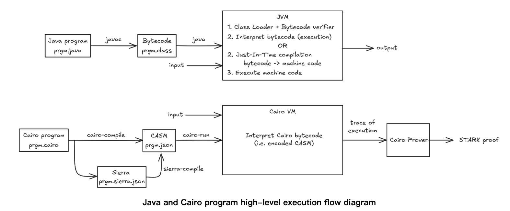

# ETAAcademy-ZKMeme: 46. zkVM

<table>
  <tr>
    <th>title</th>
    <th>tags</th>
  </tr>
  <tr>
    <td>46. zkVM</td>
    <td>
      <table>
        <tr>
          <th>zk-meme</th>
          <th>basic</th>
          <th>quick_read</th>
          <td>zkVM</td>
        </tr>
      </table>
    </td>
  </tr>
</table>

[Github](https://github.com/ETAAcademy)｜[Twitter](https://twitter.com/ETAAcademy)｜[ETA-ZK-Meme](https://github.com/ETAAcademy/ETAAcademy-ZK-Meme)

Authors: [Eta](https://twitter.com/pwhattie), looking forward to your joining

# zkVM: Trusted Execution

The design principles of zkVM (Zero-Knowledge Virtual Machine) diverge from those of traditional virtual machines, focusing on ensuring the trustworthiness of program execution through cryptographic proofs by records of every step of the execution to generate a proof that verifies the correctness of the process. With a memory model based on read-only and write-once principles, Cairo VM guarantees data consistency and immutability, using memory management, execution model, the hint mechanism that optimizes proof generation, and the built-in features and opcode design that ensure transparent and secure execution.

## 1. zkVM & Traditional Virtual Machines

zkVM differs fundamentally from traditional virtual machines by not only executing a program but also generating a cryptographic proof to guarantee the correctness of the result. Unlike standard VMs, which require the program to be re-executed to verify outcomes, zkVM enables others to verify the result by simply checking the provided proof without re-running the program. This section contrasts zkVM with the Ethereum Virtual Machine (EVM), showcasing their different approaches to program execution.

In a traditional VM like the EVM, the process involves:

1. Writing the program and compiling it into bytecode.
2. Parsing the bytecode using an interpreter.
3. Executing the instructions sequentially.
4. Producing input/output (IO) results.

zkVM follows a similar process but with a critical difference: it guarantees the correctness of the execution by generating a **proof**. For instance, with ZKVM implementations such as **Cairo**, the program is written in a high-level language, possibly compiled into assembly, and then executed. The result mirrors that of a traditional VM, but in ZKVM, the focus is on **proving** that the program was executed correctly. The proof assures others that the given input produces the expected output under the agreed rules, eliminating the need for re-execution by the verifier.

The proof is presented to a verifier, who uses it to confirm the correctness of the execution. This contrasts with traditional VMs, where verification requires the program to be executed from scratch to confirm the outcome.

<div  align="center"> 

</div>

**Architecture Comparison: EVM vs. ZKVM**

The **Ethereum Virtual Machine (EVM)** operates as a simple stack-based architecture. It has a **program counter** that controls the execution of instructions sequentially. During execution, local variables are stored temporarily in the stack. As the program progresses, the stack values change based on function calls and operations. Memory, on the other hand, stores long-term data throughout the execution. This traditional VM model concludes with an IO operation or output, reflecting the program's result.

However, ZKVM introduces new challenges. It must not only generate the correct output but also **prove** that each step leading to the output was executed correctly. In ZKVM, every **execution step** needs to be well-documented to ensure that both the result and the sequence of operations are valid.

**ZKVM’s Proof Generation and Verification Process**

The ZKVM process involves the following stages:

1. **Input** ⇒
2. **Program Execution and Instruction Processing** ⇒
3. **Memory State Transitions** ⇒
4. **Output with Proof**.

A distinctive feature of ZKVM, especially in Cairo-based implementations, is the integration of **stack and memory** into a unified structure. Memory is treated as **read-only** after writing, meaning data can only be added but not modified, ensuring immutability.

ZKVM meticulously records each step of the program execution and converts it into **tabular form**, which is then submitted to a backend proving system. The verifier uses the proof and public data to confirm the correctness of the execution. This process involves several phases, such as:

- **Generating polynomials** to represent constraints.
- **Breaking down constraints** into manageable components.
- Using **low-degree testing** to verify the proof’s validity.
- Implementing **gates** (e.g., addition gates, multiplication gates) to facilitate complex operations like lookups during verification.

The goal is to guarantee that every part of the execution adheres to the expected rules.

## 2. Cairo’s Memory Model: Redefining Blockchain Programming with Immutability and Verifiability

Cairo, a programming language developed for zero-knowledge proof (ZKP) systems, introduces a novel approach to memory management, emphasizing **data consistency, immutability, and traceability**. Traditional virtual machines (VMs) struggle to maintain precise execution logs, leading to potential inconsistencies—particularly problematic for blockchain applications requiring transparent and verifiable computation. Cairo solves these challenges by adopting a **read-only and write-once memory architecture**, enabling efficient and provable program execution. This article explores Cairo’s memory structure, execution model, and how it ensures both verifiability and computational power with minimal instructions.

**Challenges in Traditional Virtual Machines**

In most programming environments, memory is mutable. Functions store data on a **stack** that changes dynamically, discarding variables once a function completes. Memory management is further complicated by **garbage collection**, which periodically clears unused memory. These mechanisms make it difficult to **trace the exact sequence of operations** and guarantee consistent state replication—critical requirements for **blockchain applications and zero-knowledge systems**.

Cairo takes a fundamentally different approach by merging stack operations and memory into a single, immutable data structure. In this system, memory grows **linearly**—once data is added, it cannot be modified or removed. This ensures a **complete and verifiable execution history**, giving validators confidence that the program has been executed exactly as specified.

Cairo architecture focus on their trade-offs in efficiency and algorithm implementation.

1. **Memory Models**:

   - **Read-Write Memory**: Standard memory model allowing data to be read and written at any time.
   - **Write-Once Memory**: Memory where values can only be written once, and attempts to rewrite or read before writing will fail.
   - **Nondeterministic Read-Only Memory**: Memory where values are predetermined by the prover and immutable. Programs can only read from it.

   ```
   write (address=20, value=7)
   ...
   x = read (address=20)  // (a) Read-Write Memory

   write (address=20, value=7)
   ...
   x = read (address=20)  // (b) Write-Once Memory

   y = read (address=20)
   assert y == 7
   ...
   x = read (address=20)  // (c) Nondeterministic Read-Only Memory

   ```

   Though the code appears similar across models, write-once and nondeterministic read-only memory share characteristics that offer more certainty in value retrieval than the read-write model.

2. **Efficiency in AIR (Algebraic Intermediate Representation)**:
   - Nondeterministic Read-Only Memory enhances efficiency by making memory access representation in AIR more optimized, even though it limits some algorithm flexibility.
   - Memory access in Cairo is efficient, using a continuous address space and minimizing the number of trace cells required per access.
3. **Public Memory**:
   - Cairo allows certain memory addresses and their values to be shared between the prover and verifier, called public memory. This mechanism enables efficient verification of memory content through minimal computational costs.
     Cairo's public memory allows the prover to show the verifier that specific memory addresses contain certain values using shared pairs $(a_i, v_i)$. The verification involves computing:
     $\prod_i (z - (a_i + \alpha \cdot v_i))$
     This process is efficient, requiring minimal arithmetic operations and a hash computation, which need extra constraints for each trace cell. It can be used to load program bytecode and pass parameters. In blockchain applications, public memory helps reduce verification costs, especially for large state change logs, by using contiguous memory cells, and alternative methods may increase proof costs

**Write-Once Memory: A New Approach to Immutability**

Cairo’s memory model treats data as **write-once**: once a value is stored, it cannot be changed. To simulate **read-write behavior**, Cairo tracks new values in different memory cells rather than overwriting existing ones. This technique ensures immutability while enabling programs to update data as needed.

Memory is divided into several **segments** to store different types of data:

- **Program Segment**: Stores instructions for the program.
- **Execution Segment**: Holds data used during the program’s runtime.
- **User Segment**: Contains user-defined data structures.
- **Built-in Segment**: Includes system-level functions, such as cryptographic operations.

Each memory segment is further divided into addressable units. These units not only store values but can also reference **other memory locations**, creating a structured and traceable execution path.

**Optimizing Read-Write Simulation with Hints and Salt**

Since Cairo records every memory access and operation, **proof generation** can become resource-intensive, especially when working with large data structures. Cairo addresses this challenge through two techniques: **hints** and **salt-based sorting**.

- **Hints** provide direct guidance to the program about the location of required data, reducing the need for exhaustive searches. However, additional **proofs** are needed to ensure the correctness of these hints, preventing invalid or outdated references.
- **Salt-based sorting** helps organize memory by assigning salt values to identical keys, ensuring that the latest value appears in predictable positions. This minimizes lookup times and reduces the overhead of tracking every change.

By using these optimizations, Cairo simplifies the verification process, keeping the cost of proofs manageable without compromising traceability.

**Key Pointers: PC, AP, and FP**

Cairo’s execution model revolves around three essential pointers:

1. **Program Counter (PC)**: Tracks the address of the current instruction.
2. **Allocation Pointer (AP)**: Points to the first unused memory cell. As the program progresses, `AP` increments to reflect memory usage.
3. **Frame Pointer (FP)**: Marks the start of the current function’s local memory. During function calls, `FP` is set to the current value of `AP`. When the function returns, `FP` reverts to its previous state, ensuring efficient access to variables and parameters.

Unlike traditional VMs, Cairo does not rely on a separate stack for function management. Instead, **functions store their inputs, outputs, and intermediate values directly in memory**, simplifying data access and making the execution trace easier to verify.

**Achieving Turing Completeness with Minimal Instructions**

Cairo achieves **Turing completeness** with a small instruction set consisting of **addition, multiplication, and conditional jumps**. Despite its minimalism, these instructions are powerful enough to construct complex logic and iterative loops, similar to esoteric languages like **Brainfuck**.

The following example demonstrates how Cairo computes the **Fibonacci sequence**:

```cairo
# Initialize the Fibonacci sequence with (1, 1).
[ap] = 1; ap++
[ap] = 1; ap++

body:
# Decrease the iteration counter.
[ap] = [ap - 3] - 1; ap++

# Copy the last Fibonacci item.
[ap] = [ap - 2]; ap++

# Compute the next Fibonacci item.
[ap] = [ap - 3] + [ap - 4]; ap++

# If the counter is not zero, jump back to the body.
jmp body if [ap - 3] != 0

__end__:
jmp __end__  # Infinite loop to signal completion.
```

In this example, the **PC** points to the current instruction, while **AP** manages memory allocation by incrementing with each step. Since Cairo integrates function calls into its memory model, it eliminates the need for a dedicated stack, enabling seamless **function execution** within the same memory space.

**Function Calls without Stacks**

Cairo’s design merges **stack functionality with memory** by storing function parameters and local variables directly in the **memory segment**. When a function is called, Cairo saves the current **FP** into an `AP` cell and assigns the necessary parameters to subsequent cells. After the function completes, Cairo restores the original `FP` and resumes execution from the parent function’s **return address**.

This seamless handling of function calls allows Cairo to manage **nested function executions** efficiently without relying on traditional stacks. As a result, all function-related data is preserved within the memory, ensuring a complete and transparent trace of the execution.

## 3. Exploring Key-Value Verification and Optimization in zkVM

The challenge of locating and verifying data in a virtual machine environment, specifically within ZKVM, is non-trivial. Traditional ZKVMs necessitate a comprehensive record of all execution processes, resulting in extensive proof data generation. In contrast, the Cairo VM employs a hint mechanism, which allows it to directly inform the verifier of specific answers. This innovative approach drastically reduces the overhead associated with data lookup and proof generation.

However, the introduction of hints can lead to non-deterministic outcomes. For example, when verifying the square root function, both positive and negative roots may validate, potentially compromising system security. Consequently, many modern ZKVMs have opted not to provide hint functionalities, prioritizing internal safety. Despite this, internal optimizations are being implemented in ZKVMs to automate hint provision, thereby minimizing the data generated during proof construction. The introduction of Builtins mechanisms further aids in reducing proof size, enhancing efficiency while diminishing the need for external processing.

### 3.1 Hint: Designing an External Key-Value Verification Program

The next step involves crafting an external program to verify whether specific key-value pairs meet designated criteria, utilizing Python for implementation. The core elements of this design encompass:

1. **Rule and Calculation Design:** This includes establishing constraints such as instruction flags and program counter (PC) update rules.
2. **Bit Constraints:** Ensuring data conforms to a binary state (zero or one).
3. **Sorting and Boundary Constraints:** Validating that data is sorted in ascending order.
4. **Table Generation and Consistency Checks:** Guaranteeing data integrity and correctness.

The optimization method of Cairo’s hint system allows for a more efficient verification process. Instead of painstakingly searching for a key $K_N$, the verifier can be directly informed of the value’s location, significantly streamlining the verification process.

```cairo
from starkware.cairo.common.math import assert_nn_le

struct KeyValue {
    key: felt,
    value: felt,
}

// Returns the value associated with the given key.
func get_value_by_key{range_check_ptr}(
    list: KeyValue*, size, key
) -> (value: felt) {
    alloc_locals;
    local idx;
    %{
        // Populate idx using a hint.
        ENTRY_SIZE = ids.KeyValue.SIZE
        KEY_OFFSET = ids.KeyValue.key
        VALUE_OFFSET = ids.KeyValue.value
        for i in range(ids.size):
            addr = ids.list.address_ + ENTRY_SIZE * i + \
                KEY_OFFSET
            if memory[addr] == ids.key:
                ids.idx = i
                break
        else:
            raise Exception(
                f'Key {ids.key} was not found in the list.')
    %}

    // Verify that we have the correct key.
    let item: KeyValue = list[idx];
    assert item.key = key;

    // Verify that the index is in range (0 <= idx <= size - 1).
    assert_nn_le(a=idx, b=size - 1);

    // Return the corresponding value.
    return (value=item.value);
}
```

In this implementation, the hint is not executed within Cairo itself but is instead executed externally through Python, which locates the key-value pairs and communicates the results back to the Cairo VM for validation. This design significantly mitigates the proof generation overhead associated with searching for data.

However, the use of hints can introduce challenges, as they may yield non-deterministic results. For instance, both $5$ and $-5$ are valid square roots of $25$, highlighting the potential risks in relying on hint-based verification.

```text
[ap] = 25; ap++
# [ap - 1] is now 25, so the next line enforces that [ap] is the
# square root of 25.
[ap - 1] = [ap] * [ap]; ap++
```

### 3.2 Deterministic vs. Nondeterministic Machines

Cairo defines two versions of its machine: **deterministic** and **nondeterministic**. The **deterministic machine** validates a sequence of state transitions, while the **nondeterministic machine** works with partial memory and only initial/final states.

Deterministic Cairo Machine

The deterministic Cairo machine **validates a computation trace** by checking the correctness of state transitions. It takes the following inputs:

- $T \in \mathbb{N}$: number of steps,
- Memory function m: $F \to F$,
- Sequence of states $S = \{S_0, \dots, S_T\}$ with $S_i = (pc_i, ap_i, fp_i) \in F^3$.

It outputs **"accept"** if every transition $S_i \to S_{i+1}$ is valid, using the same memory function m.

- The memory is **immutable** during transitions (read-only).
- Only a small subset of memory values is accessed during execution, making the memory function sparse.

Nondeterministic Cairo Machine

The **nondeterministic Cairo machine** works with **partial memory** and only requires the **initial and final states**. It takes:

- $T \in \mathbb{N}$: number of steps,
- Partial memory $m^{\*}$: $A^{\*} \to F$ where $A^{\*} \subseteq F_P$,
- Initial and final values: $(pc_I, pc_F, ap_I, ap_F)$.

It accepts the input if there exists:

- A **complete memory function** $m: F \to F$ that extends $m^*$,
- A valid sequence of states $S = \{S_0, \dots, S_T\}$, where:
  - $S_0 = (pc_I, ap_I, ap_I)$,
  - $pc_T = pc_F$,
  - $ap_T = ap_F$.

Key Differences from the Deterministic Version:

1. The nondeterministic version only requires **initial and final states**, not the full trace.
2. It operates with **partial memory** instead of complete memory.
3. It relies on a **nondeterministic machine** for efficient resolution, unlike the deterministic version, which can be checked in polynomial time.

### 3.3 Understanding Builtins in Cairo VM

The Cairo Virtual Machine (Cairo VM) offers a powerful mechanism called "Builtins" that significantly enhances the efficiency and security of zero-knowledge proofs (ZKPs). Alongside the **hint** mechanism, which provides a way to streamline the proof generation process, Builtins serve as another tool to optimize the size and complexity of generated proofs.

Builtins in Cairo VM are predefined interfaces that allow external implementations to be called from within the VM. This structure offers developers flexibility while maintaining a high level of security, as Builtins operate within isolated memory segments. The design and implementation of Builtins are primarily handled by core developers, meaning that ordinary developers cannot customize them. Currently, there are eight Builtins available, with the potential for future expansion.

**Types of Builtins**

Builtins can be categorized into two main types:

1. **Validation Builtins**: These Builtins function based on specific rules and constraints. For example, a **range check** builtin validates that a value falls within a predetermined range. This rule is defined through functional programming principles, which only trigger the execution of the builtin when needed. In practice, this means that during the execution segment, the range check can confirm whether a value (e.g., 15) is less than $2^{128}$. If the validation is successful, the address of the valid value is recorded in the range check segment.

2. **Auto-Detection Builtins**: Unlike validation Builtins, auto-detection Builtins rely on the computation patterns observed during prior executions. They automatically identify the required Builtins based on the context and input data. For instance, when calculating a hash value, the auto-detection mechanism retrieves the appropriate Builtins without requiring manual computation. Instead, the input values (e.g., 17 and 37) are processed, and the resulting hash is stored in the execution memory cell. This abstraction allows developers to import high-level hashing algorithms in their Cairo code, while the underlying computations are efficiently managed by the Builtins.

**Advantages of Builtins**

The primary advantage of Builtins is their ability to reduce the size of generated proofs while maintaining high security and reliability. Each Builtin occupies an independent memory segment, which enhances the overall architecture of the Cairo VM. This separation not only facilitates better management of memory resources but also ensures that the execution environment remains secure and free from potential interference.

Furthermore, Builtins enable a more flexible programming model. By providing standardized interfaces, developers can implement functionality externally while adhering to the Cairo VM's requirements. This flexibility encourages creativity and innovation, as developers can leverage Builtins to enhance their applications without being constrained by the limitations of the Cairo language.

It is crucial to recognize that builtins are optional within the Cairo architecture; one can substitute a builtin with a segment of pure Cairo code that achieves the same outcome, leveraging nondeterministic programming. For instance, to implement the range-check builtin, one might "guess" the 128 field elements $b_i$ that constitute the binary representation of x, asserting that $b_{2i} = b_i$ for all $i \in [0, 128)$ and that $x = \sum_{i} 2^i \cdot b_i$. This method ensures that x remains within the expected range. However, comparing the costs of the two methods reveals that the computation described above requires at least $3 \cdot 128$ Cairo instructions, whereas utilizing a builtin only necessitates a number of trace cells equivalent to approximately 1.5 instructions.

```cairo

# Context: m(.).
# Input state: (pc, ap, and fp).
# Output state: (next_pc, next_ap, and next_fp).
# Compute op0.
if op0_reg == 0:
    op0 = m(ap + offop0)
else:
    op0 = m(fp + offop0)

# Compute op1 and instruction_size.
switch op1_src:
    case 0:
        instruction_size = 1
        op1 = m(op0 + offop1)
    case 1:
        instruction_size = 2
        op1 = m(pc + offop1)
    case 2:
        instruction_size = 1
        op1 = m(fp + offop1)
    case 4:
        instruction_size = 1
        op1 = m(ap + offop1)
    default:
        Undefined Behavior

# Compute res.
if pc_update == 4:
    if res_logic == 0 && opcode == 0 && ap_update != 1:
        res = Unused
    else:
        Undefined Behavior
else if pc_update in {0, 1, 2}:
    switch res_logic:
        case 0: res = op1
        case 1: res = op0 + op1
        case 2: res = op0 * op1
        default: Undefined Behavior
else:
    Undefined Behavior

# Compute dst.
if dst_reg == 0:
    dst = m(ap + offdst)
else:
    dst = m(fp + offdst)

# Compute the new value of pc.
switch pc_update:
    case 0: # The common case:
        next_pc = pc + instruction_size
    case 1: # Absolute jump:
        next_pc = res
    case 2: # Relative jump:
        next_pc = pc + res
    case 4: # Conditional relative jump (jnz):
        next_pc = if dst == 0: pc + instruction_size else: pc + op1
    default: Undefined Behavior

# Compute new value of ap and fp based on the opcode.
if opcode == 1:
    # "Call" instruction.
    assert op0 == pc + instruction_size
    assert dst == fp
    # Update fp.
    next_fp = ap + 2
    # Update ap.
    switch ap_update:
        case 0: next_ap = ap + 2
        default: Undefined Behavior
else if opcode in {0, 2, 4}:
    # Update ap.
    switch ap_update:
        case 0: next_ap = ap
        case 1: next_ap = ap + res
        case 2: next_ap = ap + 1
        default: Undefined Behavior
    switch opcode:
        case 0:
            next_fp = fp
        case 2:
            # "ret" instruction.
            next_fp = dst
        case 4:
            # "assert equal" instruction.
            assert res = dst
            next_fp = fp
        else: Undefined Behavior

```

## 4.Cairo VM System

The opcode of the Cairo VM is characterized by its simplicity, incorporating commands such as `call` and `jump` without inserting a program counter (PC) in the process. This minimalistic design approach allows for efficient execution. Within a program segment, all specified data is stored in a 64-bit data structure, where the first 16 bits represent the offset of the target address, and the subsequent bits serve as offsets for operands. These offsets are combined with a base address to form the actual addresses. The design also includes flags for determining the Address Pointer (AP) or Frame Pointer (FP) and rules for updating the PC, which collectively dictate the program's execution flow.

Notably, the PC instruction facilitates conditional jumps. If the condition is not met, the next PC can equal any one of three mutually exclusive options. The PC's design is divided into two scenarios: when the Data Read Check (DRC) is zero or non-zero, with the latter being simpler to manage.

After the execution phase, a proof generation table is created. Once the program has executed completely and the memory is populated, it must be systematically transformed into a table format (akin to a data table) to be sent to the backend proof system. Each instruction within the Cairo VM is represented by its opcode, which is minimal—only including a `call` or `jump`. The instruction consists of a single 64-bit data word, where the first 16 bits denote the destination address, while OP0 and OP1 are the offsets. The real addresses are formed by combining these offsets with base data. The state transition rules define the AP's next address and the memory cell from which OP1 will retrieve data.

#### Structure of a Cairo Instruction

Each Cairo instruction is structured as follows:

1. **First Word**: 15 flag bits $f_{\*}$ and 3 offsets $off_{\*}$.
2. **Second Word (Optional)**: An immediate value (field element).

**Flag Definitions**

- dst_reg = $f_{DST_REG}$
- op0_reg = $f_{OP0_REG}$
- op1_src = $f_{OP1 \_IMM}+2⋅f_{OP1\_FP}+4⋅f_{OP1\_AP}$
- res_logic = $f_{RES\_ADD}+2⋅f_{RES\_MUL}$
- pc_update = $f_{PC\_JUMP_ABS}+2⋅f_{PC\_JUMP\_REL}+4⋅f_{PC\_JNZ}$
- ap_update = $f_{AP\_ADD}+2⋅f_{AP\_ADD1}$
- opcode = $f_{OPCODE\_CALL}+2⋅f_{OPCODE\_RET}+4⋅f_{OPCODE_ASSERT\_EQ}$

**Offset and Virtual Columns**

Offsets $\text{off}^*$ (where \* can be `op0`, `op1`, or `dst`) are shifted for consistency:

$\tilde{\text{off}}^* = \text{off}^* + 2^{15} \quad \text{(ensures } \tilde{\text{off}}^* \in [0, 2^{16}))$

Instead of separate columns, we store all flag bits in one virtual column $\{ \tilde{f}i \}{i=0}^{15}$ of size 16N.

**Flag Extraction Formula**

To extract a flag  fi from $\tilde{f}i:$
$f_i = \tilde{f}i - 2 \tilde{f}{i+1}$

The constraint for each bit is:

$\text{Bit}(\tilde{f}i - 2 \tilde{f}{i+1})(\tilde{f}i - 2 \tilde{f}{i+1} - 1) = 0, \quad \tilde{f}_{15} = 0$

**Instruction Encodings**

An instruction $inst$ is encoded as:

$inst = \tilde{\text{off}}{\text{dst}} + 2^{16} \cdot \tilde{\text{off}}{\text{op0}} + 2^{32} \cdot \tilde{\text{off}}_{\text{op1}} + 2^{48} \cdot \tilde{f}_0$
The total value must satisfy:
$0 \leq inst < 2^{63}$

**Instruction Decodings**

For a unique integer $inst_Z \in [0, 2^{63})$, the flags and offsets correspond to specific bit ranges:

- $f_i = \tilde{f}i - 2 \tilde{f}{i+1}$ matches the $(3 \cdot 16 + i)$-th bit of $inst_Z$.
- Each $\tilde{\text{off}}^*$ occupies 16 bits.

This ensures that an instruction is valid if all constraints are met.

The first constraint relates to the instruction flag, where the instruction is divided into two parts: three offset data in the front and a series of 0s or 1s afterward. The initial constraint applies to the instruction, calculated according to the previously designed rules. Since all data is either 0 or 1, summing all data produces two constraints: Bit and Last value is zero. Additionally, a boundary constraint is enforced, ensuring the final element remains zero.

```cairo
// Constraint: cpu/update_registers/update_pc/tmp0.
tempvar value = (column8_row0 - cpu__decode__opcode_range_check__bit_9 * column4_row9) *
    domain142 / domain4;
tempvar total_sum = total_sum + constraint_coefficients[12] * value;

// Constraint: cpu/update_registers/update_pc/tmp1.
tempvar value = (column8_row8 - column8_row0 * column7_row15) * domain142 / domain4;
tempvar total_sum = total_sum + constraint_coefficients[13] * value;

// Constraint: cpu/update_registers/update_pc/pc_cond_negative.
tempvar value = (
    (1 - cpu__decode__opcode_range_check__bit_9) * column4_row16 +
    column8_row0 * (column4_row16 - (column4_row0 + column4_row13)) -
    (
        cpu__decode__flag_pc_update_regular_0 * npc_reg_0 +
        cpu__decode__opcode_range_check__bit_7 * column7_row15 +
        cpu__decode__opcode_range_check__bit_8 * (column4_row0 + column7_row15)
    )
) * domain142 / domain4;
tempvar total_sum = total_sum + constraint_coefficients[14] * value;

// Constraint: cpu/update_registers/update_pc/pc_cond_positive.
tempvar value = (
    (column8_row8 - cpu__decode__opcode_range_check__bit_9) * (column4_row16 - npc_reg_0)
) * domain142 / domain4;
tempvar total_sum = total_sum + constraint_coefficients[15] * value;

// Constraint: cpu/update_registers/update_ap/ap_update.
tempvar value = (
    column7_row19 -
    (
        column7_row3 +
        cpu__decode__opcode_range_check__bit_10 * column7_row15 +
        cpu__decode__opcode_range_check__bit_11 +
        cpu__decode__opcode_range_check__bit_12 * 2
    )
) * domain142 / domain4;
tempvar total_sum = total_sum + constraint_coefficients[16] * value;

// Constraint: cpu/update_registers/update_fp/fp_update.
tempvar value = (
    column7_row27 -
    (
        cpu__decode__fp_update_regular_0 * column7_row11 +
        cpu__decode__opcode_range_check__bit_13 * column4_row9 +
        cpu__decode__opcode_range_check__bit_12 * (column7_row3 + 2)
    )
) * domain142 / domain4;
tempvar total_sum = total_sum + constraint_coefficients[17] * value;
```

Following this, the constraints for the PC computation determine how to calculate the next PC, translating these rules into constraints—specifically the four regular update rules that result in either 0 or 1. The PC is bifurcated into two scenarios, which can be grouped, while situations where $dst = 0$ must remain isolated.

Constructing the proof involves utilizing the generated instruction to create a polynomial.

**Read-Only Memory Constraints**

Memory is treated as read-only and thus requires a constraint. It is categorized into two segments: address and value. After sorting the addresses, they exhibit continuity. The single value ensures that memory remains unchanged; if the address remains constant, the value does too. A permutation constraint indicates that $L2$ effectively sorts according to $L1$ based on addresses. The proof method ensures that the product of all elements in these two data sets remains constant.

Additionally, constraints for the instruction enforce that offset values lie within the range of 0 to $2^{16}$.

**State Transition**

Cairo’s state transition function, optimized for Algebraic Intermediate Representation (AIR) implementation, restricts certain flag groups like `op1_src` to values \{0, 1, 2, 4\}, ensuring that only one of the bits $f_{OP1\_IMM}$, $f_{OP1\_FP}$, $f_{OP1\_AP}$ can be set at any moment.

This approach allows for efficiency during execution while maintaining strong integrity and security within the Cairo programming environment, thus enhancing its capability to manage complex computations in decentralized applications.

```cairo

# Context: m(.).
# Input state: (pc, ap, and fp).
# Output state: (next_pc, next_ap, and next_fp).
# Compute op0.
if op0_reg == 0:
    op0 = m(ap + offop0)
else:
    op0 = m(fp + offop0)

# Compute op1 and instruction_size.
switch op1_src:
    case 0:
        instruction_size = 1
        op1 = m(op0 + offop1)
    case 1:
        instruction_size = 2
        op1 = m(pc + offop1)
    case 2:
        instruction_size = 1
        op1 = m(fp + offop1)
    case 4:
        instruction_size = 1
        op1 = m(ap + offop1)
    default:
        Undefined Behavior

# Compute res.
if pc_update == 4:
    if res_logic == 0 && opcode == 0 && ap_update != 1:
        res = Unused
    else:
        Undefined Behavior
else if pc_update in {0, 1, 2}:
    switch res_logic:
        case 0: res = op1
        case 1: res = op0 + op1
        case 2: res = op0 * op1
        default: Undefined Behavior
else:
    Undefined Behavior

# Compute dst.
if dst_reg == 0:
    dst = m(ap + offdst)
else:
    dst = m(fp + offdst)

# Compute the new value of pc.
switch pc_update:
    case 0: # The common case:
        next_pc = pc + instruction_size
    case 1: # Absolute jump:
        next_pc = res
    case 2: # Relative jump:
        next_pc = pc + res
    case 4: # Conditional relative jump (jnz):
        next_pc = if dst == 0: pc + instruction_size else: pc + op1
    default: Undefined Behavior

# Compute new value of ap and fp based on the opcode.
if opcode == 1:
    # "Call" instruction.
    assert op0 == pc + instruction_size
    assert dst == fp
    # Update fp.
    next_fp = ap + 2
    # Update ap.
    switch ap_update:
        case 0: next_ap = ap + 2
        default: Undefined Behavior
else if opcode in {0, 2, 4}:
    # Update ap.
    switch ap_update:
        case 0: next_ap = ap
        case 1: next_ap = ap + res
        case 2: next_ap = ap + 1
        default: Undefined Behavior
    switch opcode:
        case 0:
            next_fp = fp
        case 2:
            # "ret" instruction.
            next_fp = dst
        case 4:
            # "assert equal" instruction.
            assert res = dst
            next_fp = fp
        else: Undefined Behavior

```

**Summarized Takeaways**

- **Simplicity**: Minimal opcode structure allows for efficient program execution.
- **Flexibility**: Conditional jumps and dynamic memory addressing facilitate complex program flows.
- **Integrity**: Constraints on instruction encoding and state transitions ensure correctness and security in program execution.

This thorough design underscores the potential of the Cairo programming language as a robust solution for blockchain applications, enhancing both performance and reliability.

## Conclusion

Builtins are a critical component of the Cairo VM architecture, complementing the hint mechanism by optimizing proof generation and enhancing overall performance. As the ecosystem continues to evolve, the potential for expanded capabilities remains promising, further solidifying Cairo VM’s position as a leading platform for zero-knowledge proofs and decentralized applications.

[Cairo](https://github.com/ETAAcademy/ETAAcademy-ZK-Meme/tree/main/Appendix/cairo)

<div  align="center"> 

</div>
