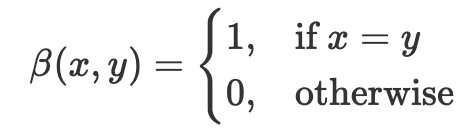
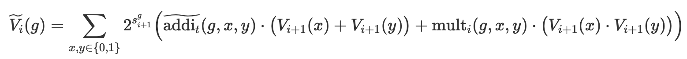

# ETAAcademy-ZKMeme: 49. ZK Bridge

<table>
  <tr>
    <th>title</th>
    <th>tags</th>
  </tr>
  <tr>
    <td>49. ZK Bridge</td>
    <td>
      <table>
        <tr>
          <th>zk-meme</th>
          <th>basic</th>
          <th>quick_read</th>
          <td>ZK Bridge</td>
        </tr>
      </table>
    </td>
  </tr>
</table>

[Github](https://github.com/ETAAcademy)｜[Twitter](https://twitter.com/ETAAcademy)｜[ETA-ZK-Meme](https://github.com/ETAAcademy/ETAAcademy-ZK-Meme)

Authors: [Evta](https://twitter.com/pwhattie), looking forward to your joining

# ZK Bridge: Cross-Chain Technologies

Cross-chain technologies enable seamless interaction between blockchains using mechanisms like notary systems (relying on trusted or distributed nodes), hash time-lock contracts (ensuring trustless asset swaps), and relay systems (synchronizing data and verifying transactions across chains). Advanced protocols such as LayerZero, ZkBridge, HOP, and Across employ innovations like oracles, zero-knowledge proofs, and relayers to enhance security, decentralization, and efficiency. ZkBridge, in particular, uses zk-SNARKs to achieve trustless synchronization by combining block header relays, update contracts, and application contracts, providing a secure and scalable solution for inter-chain operations.

---

## **1. Types of Cross-Chain Technologies**

Cross-chain technology is pivotal for enabling the flow of information and assets between blockchains. It primarily relies on the following mechanisms:

**1. Notary Mechanism**

**Principle:**  
This approach involves trusted third parties, referred to as notaries, who monitor on-chain events and execute cross-chain operations.

**Types:**

- **Single-Signature Notary Mechanism:**  
  A single node is responsible for operations. This approach is simple and efficient but poses centralization risks.
- **Multi-Signature Notary Mechanism:**  
  A consortium of nodes must reach a consensus before execution, offering higher security.
- **Distributed Signature Notary Mechanism:**  
  Using multi-party computation to distribute keys, this method enhances key security and privacy.

**Use Cases:**  
Ideal for cross-chain asset transfers and exchanges, such as centralized exchanges and certain decentralized bridges.

**2. Hash Time-Lock Contracts (HTLC)**

**Principle:**  
HTLC enables asset exchanges between chains without relying on a trusted third party by using hash functions and time-lock contracts.

**Key Features:**

- Secures funds using hash-based proofs.
- If operations are not completed within a specified timeframe, funds are automatically refunded.

**Use Cases:**  
Point-to-point asset transfers across chains, suitable for simple transfer operations.

**3. Relay Mechanism**

**Principle:**  
Relays act as a "bridge" to synchronize data between blockchains in real time, enabling cross-chain verification of states and transactions.

**Process:**

1. The user initiates a cross-chain transaction on the source chain.
2. Relay nodes transfer the transaction data to the relay chain.
3. The relay chain's consensus nodes validate the transaction.
4. Upon validation, consensus nodes construct a corresponding transaction.
5. A majority of consensus nodes sign the transaction to form a signature set.
6. Relay nodes monitor the consensus results and transfer the signed transaction to the target chain.
7. The target chain executes the transaction.

**Use Cases:**  
Common in multi-chain interoperability scenarios like decentralized finance (DeFi) and cross-chain governance.

### **Protocols and Core Technologies**

| Protocol      | Core Technology       | Description                                                                                                                                 |
| ------------- | --------------------- | ------------------------------------------------------------------------------------------------------------------------------------------- |
| **LayerZero** | Oracle + Relayer      | A cross-chain interoperability protocol enabling direct communication between chains via endpoints, oracles, and relayers.                  |
| **ZkBridge**  | ZK-Proof + Relayer    | A zero-knowledge proof-based bridge that updates and verifies inter-chain states without relying heavily on oracles.                        |
| **Optimism**  | Rollup + Quick Bridge | A Layer 2 scaling solution utilizing optimistic rollups, enabling fast and secure asset transfers between Layer 1 and Layer 2.              |
| **HOP**       | hToken + Bonder       | A decentralized Rollup-to-Rollup bridge leveraging hTokens, liquidity providers (Bonders), and AMM Swaps for cross-chain asset transfers.   |
| **Across**    | Relayer + Intent      | A protocol leveraging intent systems and relayer networks for efficient cross-chain transactions, validated using UMA's optimistic oracles. |

**4. ZkBridge**

Blockchain technology is fundamentally a distributed ledger composed of sequential blocks. Each block includes a header that records metadata and links to the previous block. The **security** of a blockchain is primarily evaluated based on:

1. **Consistency:** Honest nodes’ ledgers are either prefixes of one another or can be unified.
2. **Liveness:** All accepted transactions will eventually be recorded on the blockchain.

Given that smart contracts are programs stored on blockchains, their execution and storage come at a high cost. Therefore, minimizing on-chain computation and storage is crucial.

**Core Components**

1. **Block:**  
   A block consists of a block header (blkH) and a list of transactions, represented as $blk = \{blkH; trx1,…, trxt\}$.

2. **Block Header:**  
   Stores metadata such as pointers to the previous block, the root of the Merkle tree containing transactions, and validity proofs (e.g., PoW or PoS).

3. **Merkle Trees:**  
   Merkle trees provide efficient commitment to data vectors, enabling lightweight proofs for blockchain synchronization. They are widely used in light client protocols such as SPV (Simplified Payment Verification).

   **Key Operations:**

   - $\text{MT.Commit(x)}$: Generates the Merkle root for vector $x$.
   - $\text{MT.Open(x, i)}$: Produces a proof $\pi$ for the $i$-th element of $x[i]$.
   - $\text{MT.Verify}(\pi_i, x[i], \text{rt})$: Verifies whether $\pi_i$ matches the root $\text{rt}$.

While SPV simplifies transaction verification for light clients, zkBridge introduces **zero-knowledge proofs** to achieve higher security, decentralization, privacy, and resistance to attacks.

**Components:**

ZkBridge is a zero-knowledge proof-based cross-chain bridge protocol. It achieves trustless synchronization between two blockchains using a block header relay network and a light client protocol.

1. **Block Header Relay Network:**  
   Fetches block headers from the source chain and generates zero-knowledge proofs.

2. **Update Contracts:**  
   Maintains a directed acyclic graph (DAG) of block headers and the state of the light client.

3. **Application Contracts:**  
   Verifies states using block headers and Merkle proofs.

The entire system leverages zk-SNARKs to provide enhanced security and decentralization while facilitating efficient inter-chain operations.

<details><summary><b> Code</b></summary>

```rust
use ark_serialize::CanonicalSerialize;
use sha2::digest::DynDigest;
use sha2::Sha256;
use sisulib::common::serialize;
use std::{cell::RefCell, rc::Rc};

pub struct MerkleNode<Leaf> {
    value: Vec<u8>,
    left: Option<MerkelNodeRef<Leaf>>,
    right: Option<MerkelNodeRef<Leaf>>,
}

pub type MerkelNodeRef<Leaf> = Rc<RefCell<MerkleNode<Leaf>>>;

pub struct MerkleTree<Leaf: Clone> {
    leaves: Vec<Leaf>,
    root: MerkelNodeRef<Leaf>,
}

impl<Leaf: Clone> Clone for MerkleTree<Leaf> {
    fn clone(&self) -> Self {
        Self {
            leaves: self.leaves.clone(),
            root: self.root.clone(),
        }
    }
}

impl<Leaf: CanonicalSerialize + Clone> MerkleTree<Leaf> {
    pub fn from_vec(leaves: Vec<Leaf>) -> Self {
        assert!(leaves.len().is_power_of_two());

        let mut queue: Vec<MerkelNodeRef<Leaf>> = vec![];

        let mut hasher = Sha256::default();

        for i in 0..leaves.len() {
            hasher.update(&serialize(&leaves[i]));

            queue.push(Rc::new(RefCell::new(MerkleNode {
                value: hasher.finalize_reset().to_vec(),
                left: None,
                right: None,
            })));
        }

        while queue.len() > 1 {
            let mut i = 0;
            let mut new_queue = vec![];
            while i < queue.len() {
                let l = &queue[i];
                let mut r = &queue[i];
                if i + 1 < queue.len() {
                    r = &queue[i + 1];
                }

                hasher.update(&l.borrow().value);
                hasher.update(&r.borrow().value);

                new_queue.push(Rc::new(RefCell::new(MerkleNode {
                    value: hasher.finalize_reset().to_vec(),
                    left: Some(Rc::clone(&l)),
                    right: Some(Rc::clone(&r)),
                })));

                i = i + 2;
            }
            queue = new_queue;
        }

        assert!(
            queue.len() == 1,
            "Cannot calculate the exact root of merkle tree"
        );

        Self {
            leaves,
            root: Rc::clone(&queue[0]),
        }
    }

    pub fn root(&self) -> Vec<u8> {
        self.root.borrow().value.clone()
    }

    pub fn path_of(&self, slice_index: usize) -> (Leaf, Vec<Vec<u8>>) {
        let mut path = vec![];

        let mut current_layer = self.leaves.len().ilog2() as usize;
        let mut current_node = Rc::clone(&self.root);
        while current_layer > 0 {
            let current_bit = (slice_index >> (current_layer - 1)) & 1;

            // Got the leaf node if left (or/and right) child is None.
            if let None = current_node.borrow().left {
                break;
            }

            let l: MerkelNodeRef<Leaf>;
            if let Some(node) = &current_node.borrow().left {
                l = Rc::clone(node);
            } else {
                panic!("Not found left node");
            }

            let r: MerkelNodeRef<Leaf>;
            if let Some(node) = &current_node.borrow().right {
                r = Rc::clone(node);
            } else {
                panic!("Not found right node")
            }

            let l_borrow = l.borrow();
            let r_borrow = r.borrow();

            // current_bit = 0 -> left.
            // current_bit = 1 -> right.
            if current_bit == 0 {
                current_node = Rc::clone(&l);
                path.push(r_borrow.value.clone());
            } else {
                current_node = Rc::clone(&r);
                path.push(l_borrow.value.clone());
            }

            current_layer -= 1;
        }

        (
            self.leaves[slice_index].clone(),
            path.into_iter().rev().collect(),
        )
    }

    pub fn verify_path(root: &[u8], mut slice_index: usize, v: &Leaf, path: &[Vec<u8>]) -> bool {
        let mut hasher = Sha256::default();
        hasher.update(&serialize(v));
        let mut hv = hasher.finalize_reset().to_vec();

        for neighbor in path {
            if slice_index % 2 == 0 {
                hasher.update(&hv);
                hasher.update(&neighbor);
            } else {
                hasher.update(&neighbor);
                hasher.update(&hv);
            };

            hv = hasher.finalize_reset().to_vec();

            slice_index = slice_index / 2;
        }

        &hv == root
    }
}

```

</details>

---

## **2. Distributed Proofs**

Distributed proofs involve the delegation and computation of proof generation across multiple independent nodes or machines. This approach is especially useful for tasks like zero-knowledge proof (ZKP) generation and verification. Instead of relying on a single node, distributed zero-knowledge proofs (DZKPs) enable collaborative computation, merging results into a compact proof without exposing sensitive inputs. This division of labor enhances efficiency and scalability, making distributed proofs ideal for complex cryptographic applications.

**The Generalized Sumcheck Protocol (GKR Protocol)**

The GKR protocol, introduced in [GKR08], is a hierarchical proof system where the soundness of the output layer $L_0$ is recursively reduced through intermediate layers to the input layer $L_D$. At each layer, the prover and verifier execute the **Sumcheck Protocol**, gradually simplifying the verification process until it reaches the base input. The Sumcheck Protocol validates polynomial computations by reducing multi-layer circuit checks into manageable steps, ensuring correctness layer by layer.

**Core Techniques in Distributed Proofs**

1. **Multilinear Extension:**  
    A **multilinear extension** transforms functions defined over binary inputs into polynomials over a continuous domain, enabling efficient computations and verification. For a function $V: \{0,1\}^\ell \to F$, its multilinear extension $\tilde{V}$ is a unique polynomial satisfying $\tilde{V}(x) = V(x)$ for all binary inputs $x \in \{0,1\}^\ell$.  
    **Formula:**

   $\tilde{V}(x) = \sum_{b \in \{0,1\}^\ell} \prod_{i=1}^\ell \big((1 - x_i)(1 - b_i) + x_i b_i\big) \cdot V(b)$

   This allows computations to extend from discrete binary inputs to continuous domains while retaining binary consistency, facilitating efficient operations in large-scale circuits.

2. **Identity Function:**  
   The **identity function** $\beta(x, y)$ compares two inputs:

<div  align="center"> 

</div>

Its multilinear extension generalizes this comparison to polynomial evaluation, aiding in verifying connections between circuit nodes during complex computations.

4. **Sumcheck Protocol:**  
    The **Sumcheck Protocol** validates the correctness of polynomial computations, particularly for large-scale circuits such as data-parallel architectures. It works by recursively checking each layer of a circuit, aggregating inputs, and simplifying the problem. For a multivariable polynomial $f: F^\ell \to F$, the protocol confirms its sum over all binary inputs:
   $H = \sum_{b \in \{0,1\}^\ell} f(b)$

**Execution of Distributed Sumcheck Protocol**

The protocol proceeds in phases:

1. **Phase 1 (Initial Rounds):** Each sub-circuit independently runs the Sumcheck Protocol to verify $f^{(i)}: F^{\ell-n} \to F$. The results are aggregated into a single-variable polynomial.
2. **Phase 2 (Aggregation):** Results from sub-circuits are aggregated at random point $r$, yielding a compressed polynomial $f'(x) = f(r, x[1:n])$.
3. **Phase 3 (Final Verification):** The prover and verifier run a simplified Sumcheck Protocol on $f'$ to verify correctness.

---

#### **Distributed Polynomial Commitments (PCs)**

At the final step of the Sumcheck Protocol, the prover must prove to the verifier that $y = f(r_1, \dots, r_\ell)$. This step uses a **Polynomial Commitment (PC)** scheme, such as those in the Virgo protocol, to achieve efficient verification.

In a distributed setting, each machine $\mathcal{P_i}$ holds a portion of the polynomial $f^{(i)}$. The goal is to compute and verify $f(r)$:  
$f(r) = \sum_{i=0}^{N-1} \tilde{\beta}(r[\ell-n+1:\ell], i) f^{(i)}(r[1:\ell-n]),$
where $\tilde{\beta}$ is a multilinear interpolation function.

**Methods:**

1. **Basic Approach:**
   Each machine $\mathcal{P}_i$ runs $PC.\text{Commit}$ and $PC.\text{Open}$ independently and sends the proof of $f^{(i)}$ to the verifier $\mathcal{V}$. While simple, this results in a total proof size of $O(\lambda N (\ell-n)^2)$.

2. **Optimized Approach:**
   To reduce proof size:
   - **Data Sharing and Aggregation:** Nodes collect evaluations from others at the same index, aggregating them into a single commitment.
   - **Compact Verification:** The verifier checks only the aggregated proof, reducing proof size to $O(\lambda (N + \ell^2))$.

<details><summary><b> Code</b></summary>

```rust


    // gkr phase 1 over variable x
    helper.prepare_x_vals();
    for i_var in 0..helper.input_var_num {
        let evals = helper.poly_evals_at_rx(i_var, 2);
        let r = mpi_config.transcript_io::<C::ChallengeField, T>(&evals, transcript);
        helper.receive_rx(i_var, r);
    }

    helper.prepare_simd_var_vals();
    for i_var in 0..helper.simd_var_num {
        let evals = helper.poly_evals_at_r_simd_var(i_var, 3);
        let r = mpi_config.transcript_io::<C::ChallengeField, T>(&evals, transcript);
        helper.receive_r_simd_var(i_var, r);
    }

    helper.prepare_mpi_var_vals();
    for i_var in 0..mpi_config.world_size().trailing_zeros() as usize {
        let evals = helper.poly_evals_at_r_mpi_var(i_var, 3);
        let r = mpi_config.transcript_io::<C::ChallengeField, T>(&evals, transcript);
        helper.receive_r_mpi_var(i_var, r);
    }

    let vx_claim = helper.vx_claim();
    transcript.append_field_element(&vx_claim);
...

    for i_var in 0..layer.input_var_num {
        if i_var == 0 {
            helper.prepare_g_x_vals();
        }
        let evals: [C::Field; D] = helper.poly_evals_at(i_var);

        for deg in 0..D {
            let mut buf = vec![];
            evals[deg].serialize_into(&mut buf).unwrap();
            transcript.append_u8_slice(&buf);
        }

        let r = transcript.generate_challenge_field_element();

        log::trace!("i_var={} evals: {:?} r: {:?}", i_var, evals, r);

        helper.receive_challenge(i_var, r);
        if i_var == layer.input_var_num - 1 {
            log::trace!("vx claim: {:?}", helper.vx_claim());
            let mut buf = vec![];
            helper.vx_claim().serialize_into(&mut buf).unwrap();
            transcript.append_u8_slice(&buf);
        }
    }

    log::trace!("claimed vx = {:?}", helper.vx_claim());
    let mut buf = vec![];
    helper.vx_claim().serialize_into(&mut buf).unwrap();
    transcript.append_u8_slice(&buf);

    helper.rx
}

```

</details>

---

## **3. Zero-Knowledge Proof Bridges: Optimizations and Innovations**

Zero-knowledge proof (ZKP)-based bridges are gaining attention for their ability to enhance security and scalability in cross-chain communication. Many such projects focus on **Ethereum's Sync Committee**, a group of 512 validators selected approximately daily.

**Sync Committee ZKP Bridges: Pros and Cons**

- **Advantages**: Proving the correctness of a sync committee requires minimal computational resources since only one proof is needed per day.
- **Disadvantages**: The security is relatively weak because the 512 validators represent only 0.1% of Ethereum's total validators. This limited coverage poses risks when managing large-value transactions.

### **Optimizing ZKP Bridges: Algorithms, Circuits, and Hardware Acceleration**

**Recursive SNARKs: A Key Optimization**

**Recursive SNARKs** were first introduced in [Bit+13] and have since been adopted in protocols like Halo [BGH19]. These systems combine multiple nested SNARK proofs into a single, compact proof, significantly improving verification speed and reducing proof sizes.

- **Linear and Tree Structures**:
  - In systems like Nova [KST22], recursive SNARKs operate linearly, connecting proofs in a sequence.
  - In setups like zkTree [DD23], proofs are combined in a tree-like structure, enabling parallelization.

The process works by generating proofs for individual computation layers and recursively combining them into a single proof for the entire system.

**Two-Layer Recursive Proofs**

To address size and computational challenges, a **two-layer recursive proof strategy** is often used:

1. **Layer 1: Initial Proof Generation ($\pi_1$)**  
   The proof $\pi_1$ is created using protocols like the distributed sumcheck. While this step is efficient, the resulting proof may still be large.

2. **Layer 2: Proof Compression ($\pi_2$)**  
   To reduce size further, $\pi_1$ is verified within a secondary circuit using a compact ZKP system like Groth16. The resulting $\pi_2$ is concise and can be submitted on-chain efficiently, avoiding the need for direct validation of $\pi_1$.

**Advantages and Challenges of Recursive SNARKs**

Each SNARK protocol offers a unique trade-off among proof size, proving time, verification time, and security:

- **Groth16**: Offers constant proof size (~192 bytes) and fast verification but requires a trusted setup. Its compatibility with Ethereum-native curves (e.g., BN254) ensures cost-effective on-chain verification.
- **Orion [XZS22]**: Features faster proving times but produces larger proofs, making it suitable for recursive scenarios where the output is compressed in subsequent layers.

By combining protocols, their advantages can be harnessed collectively. For example:

- A high-throughput recursive system can initially use Orion for fast proof generation and then compress the output using Groth16, achieving an optimal balance of speed and size.

Despite advancements [Che+23a; BC23], proof generation remains resource-intensive. Many current implementations rely on centralized proving setups, raising concerns about censorship and single points of failure. Distributed proving networks mitigate these risks by offering decentralized, competitive markets for ZKP services. However, they face significant challenges, such as high communication overheads. For example, handling 32,000 validator signatures in a zkBridge can generate over **32 TB** of network traffic, constraining scalability.

**Public Key Aggregation**

**Public key aggregation** reduces computational complexity by aggregating validator public keys using curve addition on BLS12-381. For instance:

- Individual validator keys are aggregated within subcircuits.
- Final aggregation produces a single public key representing the entire committee.

To ensure security, proof of public key validity is essential. Validators can demonstrate validity using Merkle proofs that connect their public keys to Ethereum's **beacon state root**. Ethereum's use of SSZ hashing and Merkle trees enables efficient validator list management.

**Accumulation Gates: Circuit Optimization**

**Accumulation gates** optimize circuit design by reducing depth and gate count while maintaining high evaluation efficiency, making them especially useful in the context of distributed systems.

- **Traditional Design**:
  Mapping multiple inputs to a single output often requires several layers, increasing circuit depth:

  $y = f(f(f(x_1, x_2), x_3), \ldots, x_n)$

- **Accumulation Gates**:
  These gates enable efficient aggregation of inputs into a single output in fewer steps:

  $y = \text{Accumulate}(x_1, x_2, \ldots, x_n)$

  This reduces depth and complexity while preserving correctness.

For instance, in recursive calculations:

<div  align="center"> 

</div>

Here, $\text{addi}$ and $\text{mult}$ represent addition and multiplication gates, and $\widetilde{V}_i$ recursively aggregates results from layer $i+1$ to layer $i$.

**Hardware Acceleration with GPUs**

Hardware acceleration leverages GPU parallelism to speed up computationally intensive tasks, such as:

- **Multi-Scalar Multiplication (MSM)**
- **Fast Fourier Transform (FFT)**

For example, in aggregation tasks:

$$
y = \sum_{i=1}^n F(x_i)
$$

GPUs can process each $F(x_i)$ in parallel, dramatically reducing computation time. This parallelization is particularly effective for repetitive and resource-heavy operations, making GPUs invaluable for ZKP proving systems.

<details><summary><b> Code</b></summary>

```c++


            // Define CUDA parameters
            int num_thread = (evalSize >= 512) ? 512 : (evalSize <= 32 ? 32 : evalSize);
            int num_block_src = (evalSize + num_thread - 1) / num_thread;

            if(var_idx == 0){
                // Allocate memory for src_v
                cudaMalloc((void **)&d_src_v, 2 * evalSize * sizeof(F));
                cudaMemcpy(d_src_v,    src_v,    2 * evalSize * sizeof(F), cudaMemcpyHostToDevice);

                // Allocate memory for bookkeeping_hg
                cudaMalloc((void **)&d_bookkeeping_hg_src, 2 * evalSize * sizeof(F));
                cudaMalloc((void **)&d_bookkeeping_hg_dst, evalSize * sizeof(F));
                cudaMemcpy(d_bookkeeping_hg_src,    bookkeeping_hg,    2 * evalSize * sizeof(F), cudaMemcpyHostToDevice);

                // Allocate memory for block results
                cudaMalloc((void **)&d_block_results, num_block_src * 3 * sizeof(F));
            }

            auto end = std::chrono::high_resolution_clock::now();

            timer.pcie_time += (double) std::chrono::duration_cast<std::chrono::microseconds>(end - start).count();

            start = std::chrono::high_resolution_clock::now();
            // Calculate the size of shared memory
            size_t sharedMemSize = 3 * num_thread * sizeof(F);

            // Launch Kernel
            poly_eval_kernel<<<num_block_src, num_thread, sharedMemSize>>>(
                    d_src_v,
                    (var_idx % 2 == 0) ? d_bookkeeping_hg_src : d_bookkeeping_hg_dst,
                    d_block_results,
                    evalSize
            );
...

            // Switch between GPU vs. CPU implementation
            if(useGPU){
                if(verbose) printf("CUDA: poly_eval_at : var_idx = %u, eval_size = %d, ", var_idx, evalSize);
                poly_eval_kernel_wrapper(src_v, p0, p1, p2, evalSize, var_idx, timer);
            }else{
                auto start = std::chrono::high_resolution_clock::now();
                if(verbose) printf("CPU: poly_eval_at : var_idx = %u, eval_size = %d\n", var_idx, evalSize);
                for (int i = 0; i < evalSize; i++){
                    if (!gate_exists[i * 2] && !gate_exists[i * 2 + 1]){ continue; }
                    auto f_v_0      = src_v[i * 2];
                    auto f_v_1      = src_v[i * 2 + 1];
                    auto hg_v_0 = bookkeeping_hg[i * 2];
                    auto hg_v_1 = bookkeeping_hg[i * 2 + 1];
                    p0 += f_v_0 * hg_v_0;
                    p1 += f_v_1 * hg_v_1;
                    p2 += (f_v_0 + f_v_1) * (hg_v_0 + hg_v_1);
                }
                auto end = std::chrono::high_resolution_clock::now();
                auto total = std::chrono::duration_cast<std::chrono::microseconds>(end - start);
                timer.polyeval_time += (double) total.count();
            }
...

            // Switch between CUDA and CPU
            if(gpuMode){
                auto start = std::chrono::high_resolution_clock::now();

                // Memory copy from Host to Device
                cudaMemcpy(d_r,&r, sizeof(F), cudaMemcpyHostToDevice);

                // Launch Kernel
                int eval_size = cur_eval_size >> 1;
                int num_thread = (eval_size >= 512) ? 512 : (eval_size <= 32 ? 32 : eval_size);
                int num_block  = (eval_size + num_thread - 1) / num_thread;

                sumcheck_kernel<<<num_block, num_thread>>>(
                        d_r,
                        d_src_v,
                        d_bookkeeping_f,
                        (var_idx % 2 == 0) ? d_bookkeeping_hg_src : d_bookkeeping_hg_dst,
                        (var_idx % 2 == 0) ? d_bookkeeping_hg_dst : d_bookkeeping_hg_src,
                        eval_size
                );
                cudaDeviceSynchronize(); // No-need to make functional correct, but necessary for time measure

                // Copy result back
                cudaMemcpy(d_src_v,  d_bookkeeping_f, eval_size * sizeof(F),    cudaMemcpyDeviceToDevice);
                auto end = std::chrono::high_resolution_clock::now();
                auto total = std::chrono::duration_cast<std::chrono::microseconds>(end - start);
                timer.challenge_time += ((double) total.count());
                if(verbose) printf("CUDA: receive_chal : var_idx = %u, eval_size = %u, #block = %d, #thread = %d, time = %.1f us\n",
                                   var_idx, eval_size, num_block, num_thread, (float) total.count());
            }else{
                auto start = std::chrono::high_resolution_clock::now();
                for (uint32_t i = 0; i < (cur_eval_size >> 1); i++){
                    if (!gate_exists[2 * i] && !gate_exists[2 * i + 1]){
                        gate_exists   [i] = false;
                        bookkeeping_f [i] = src_v[2 * i]          + (src_v[2 * i + 1]          - src_v[2 * i]         ) * r;
                        bookkeeping_hg[i] = 0;
                    }else{
                        gate_exists   [i] = true;
                        bookkeeping_f [i] = src_v[2 * i]          + (src_v[2 * i + 1]          - src_v[2 * i]         ) * r;
                        bookkeeping_hg[i] = bookkeeping_hg[2 * i] + (bookkeeping_hg[2 * i + 1] - bookkeeping_hg[2 * i]) * r;
                    }
                }
                auto end = std::chrono::high_resolution_clock::now();
                auto total = std::chrono::duration_cast<std::chrono::microseconds>(end - start);
                timer.challenge_time += ((double) total.count());
                if(verbose) printf("CPU: receive_chal : var_idx = %u, eval_size = %u, time = %.1f us\n", var_idx, cur_eval_size >> 1, (float) total.count());
            }

```

</details>

### **Conclusion**

Cross-chain technologies enable seamless blockchain interaction using mechanisms like notary systems, hash time-lock contracts, and relay systems, with advanced protocols such as LayerZero, ZkBridge, HOP, and Across employing innovations like zero-knowledge proofs (ZKPs) and oracles for enhanced security and efficiency.

ZkBridge stands out by leveraging zk-SNARKs to achieve trustless synchronization through block header relays and update contracts, offering a scalable inter-chain solution. Distributed proofs, incorporating techniques like GKR, Sumcheck, and polynomial transformations, provide scalable cryptographic computations for large-scale applications.

With advancements in recursive SNARKs, public key aggregation, optimized circuits, and GPU acceleration, ZKP bridges are rapidly evolving to deliver secure, efficient, and decentralized cross-chain operations, despite challenges like communication overheads and computational intensity.

[zkbridge](https://github.com/ETAAcademy/ETAAcademy-ZK-Meme/tree/main/Appendix/zkbridge)

[sumcheck](https://github.com/ETAAcademy/ETAAcademy-ZK-Meme/tree/main/Appendix/sumcheck)

<div  align="center"> 

</div>
